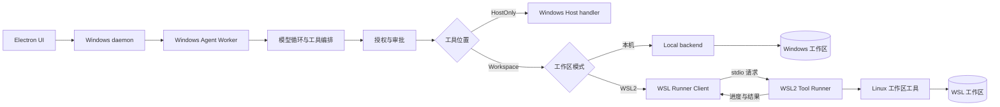
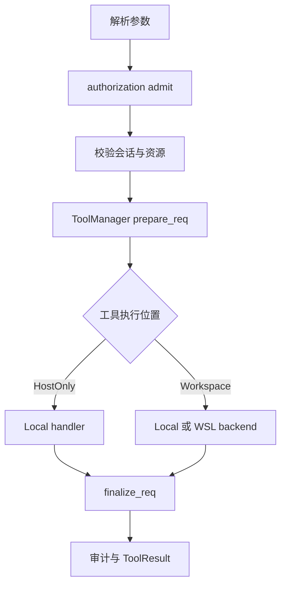

# Windows 控制面 / 可选本机或 WSL2 工作区：首轮落地计划

## 1. 结论与目标

DeepX 当前并不是把所有能力都放在单一 daemon 进程中。Windows 上的
`deepx-daemon` 会为会话启动独立的 Agent Worker；模型循环、工具授权、`ToolManager`
和实际工具 handler 主要运行在 Agent Worker 内，daemon 则负责桌面控制协议、Worker
生命周期、会话服务和 UI 事件转发。

本计划的目标是让用户在前端设置中显式选择**本机工作区**或 **WSL2 工作区**。两种模式是
长期并存的产品能力，而不是先使用 Windows、最终强制迁往 WSL2。整体形成：

- Windows 控制面：Electron、`deepx-daemon` 和 Agent Worker；
- 本机执行面：完全保留当前 Windows 工作区、路径和工具行为；
- WSL2 执行面：仅在用户选择 WSL2 工作区后启用 Linux 命令、工作区读取和工作区修改；
- Agent Worker 保留 tool schema、参数校验、权限判断、审批、Plan/Code 模式、审计、
  ToolResult 回灌和 UI 进度所有权；
- Runner 只执行已经通过 Windows 侧授权、且属于其协商 capability 的数据面请求；
- 默认行为仍为 Windows 本机执行；旧配置和旧会话自动解释为本机工作区；
- 本机模式不得探测、下载、安装或启动 WSL，也不要求用户安装 WSL2；
- WSL2 模式不可用时明确报错并提供修复入口，不静默回退或自动重放到本机；
- 完整 WSL2 模式中，Windows 进程不得再直接修改该 WSL2 工作区，但本机模式始终保留。

首轮只远程化 `exec`，用于打通启动、握手、流式输出、取消、超时和错误恢复。但必须明确：
**`exec` 本身可以创建、修改和删除文件，因此首轮不是只读阶段，只是不迁移结构化文件工具。**

这不是把整个 daemon 搬入 WSL2。daemon、Agent Worker、桌面生命周期、会话存储、升级和
审批继续留在 Windows；只把最依赖 Linux 语义的工作区执行能力迁出。

WSL Runner 首版也不是安全沙箱。它改变的是执行环境和文件系统语义，而不是自动把任意
Shell 命令限制在工作区内；严格隔离需要后续单独的 sandbox profile。

## 2. 当前实现与根因

当前主要调用路径为：

```text
Electron UI
  -> deepx-daemon
  -> deepx-runtime::AgentRegistry
  -> Windows Agent Worker
  -> deepx-msglp::ToolEngine
  -> deepx_tools::authorization::admit
  -> deepx_tools::execution::execute_authorized
  -> ToolManager::prepare_req
  -> in-process handler
  -> ToolManager::finalize_req / audit
  -> Agent2Ui progress 与 ToolResult
```

关键实现位于：

- `crates/deepx-runtime/src/registry.rs`：daemon 为每个会话启动 Agent Worker；
- `crates/deepx-runtime/src/worker.rs`：Agent Worker 进程入口；
- `crates/deepx-msglp/src/ring/engine_tool.rs`：工具授权、审批、执行和进度转发；
- `crates/deepx-msglp/src/ring/engine_turn.rs`：LLM 工具批次及最多 4 路并行执行；
- `crates/deepx-tools/src/execution.rs`：授权后校验、prepare/execute/finalize 和审计；
- `crates/deepx-tools/src/manager.rs`：handler 注册、allowlist、inflight、取消和统计；
- `crates/deepx-tools/src/exec.rs`：Windows Worker 内的进程执行和 stdout/stderr 流；
- `crates/deepx-tools/src/workspace.rs`：当前进程工作目录及工作区全局状态；
- `crates/deepx-tools/src/process_registry.rs`：当前主要服务于 subagent 的进程注册表；
- `crates/deepx-runtime/src/service.rs`：仍存在绕过 `deepx-tools` 的工作区读取、Git 和预览逻辑。

当前 `exec` 是前台执行语义：到达超时或收到取消后会终止并等待子进程，不会把该进程注册到
`ProcessRegistry`，也不会返回可供 `process_check` 查询的后台进程 ID。因此首轮可以只迁移
`exec`，但必须保持“超时即终止”的现有契约。若以后增加后台或交互式进程，
`exec`、`process_check`、`process_wait`、`process_kill` 和 `process_write` 必须作为同一个
垂直切片迁移，并共享 Runner 侧进程注册表。

**根因：**当前 OS handler 与 Agent Worker 进程内全局状态、Windows 路径、Windows 进程和
本机文件系统直接耦合。若只把 `wsl.exe bash -c` 塞进现有 `exec`，无法完整覆盖授权后路由、
流式输出、取消、并发调用、Runner 崩溃、后续文件工具和一致的审计语义。

## 3. 目标架构与所有权

目标架构如下，前端持久化的工作区模式决定执行路由；Runner client 首版位于 Agent Worker，
而不是 daemon WebSocket 层。



### 3.1 Windows 控制面

以下内容保留在现有 Windows 组件中，Runner 不得自行决定：

- daemon discovery、桌面控制协议、Agent Worker 启停、更新和重连；
- 模型请求、tool schema、tool call ID、并行/串行编排和 ToolResult 回灌；
- 会话所有权、前端审批、权限等级、可信目录和 Plan/Code 模式；
- 审计、调用统计、会话 JSONL、UI 事件排序和持久化；
- 持久化并选择 `Local` 或 `WslRunner`、模式切换策略和诊断状态；
- `ask_user` 等必须与 UI 协作的状态机。

这里的“控制面”是 daemon 与 Agent Worker 的组合，而不是单指 daemon 进程。

### 3.2 WSL2 执行面

Runner 只负责：

- 对握手协商出的 capability 做窄化 dispatch；
- Linux 进程启动、stdout/stderr、退出状态、超时和进程组终止；
- Linux 工作区 canonicalization 和结构化文件工具的路径防御；
- 返回结构化结果、相对路径、hash、diff 和受限诊断；
- 在 stdin EOF、shutdown 或父 Worker 失联时终止其管理的调用。

Runner 不负责模型循环、用户审批、会话持久化、工具 schema、权限策略或自动 fallback，且不应
编译进完整的 UI/记忆/技能控制逻辑。

### 3.3 Runner 生命周期

首版采用**每个 Agent Worker 一个懒启动 Runner**，且只在会话明确绑定为 WSL2 模式时适用：

1. 本机会话始终使用 Local backend，不执行 WSL 可用性探测，也不启动 `wsl.exe`；
2. WSL2 会话第一次路由 workspace 工具时，通过 `wsl.exe` 启动 Runner；
3. Runner 与一个 distro、Linux 用户和 canonical workspace identity 绑定；
4. 同一 Worker 的后续调用复用该连接；
5. 会话切换模式、工作区、distro 或 Linux 用户时，旧 Runner 必须关闭并重新握手；
6. Worker 退出、stdin EOF 或有限时间内无法 shutdown 时，终止 `wsl.exe` child；
7. 首版不在多个 Worker 之间共享 Runner，也不引入 daemon 级 Runner 池。

这样可以直接复用 Worker 内已有的授权证明、取消标志、进度通道和 turn 恢复逻辑。未来若
Runner 数量成为瓶颈，再单独设计 daemon 级池化协议，不能在首版隐式共享。

### 3.4 工具归属与迁移顺序

| 阶段 | 能力 | 执行位置 | 说明 |
| --- | --- | --- | --- |
| P1 | `exec` | 本机模式走 Local；WSL2 模式走 Runner | WSL2 获得 Bash/Linux 价值；两种模式下均可读写对应工作区。 |
| P2 | `read`、`list`、`search`、`diff` | 按模式选择 Local 或 Runner | 建立统一的工作区相对路径、hash 和大输出语义。 |
| P3 | `patch`，随后 `edit/edit_block/write/delete` | 按模式选择 Local 或 Runner | 单独进行 stale、软链接、原子写和断线审查。 |
| Host-only | `ask_user`、审批、会话状态 | Windows Worker | 本质是控制面状态机。 |
| Host-owned | `todo/task`、`skills`、`memory` | Windows Worker | 逻辑留在 Host；若访问工作区字节，必须改走 `WorkspaceFs` 或 Runner。 |

“Host-owned”不等于可以继续直接使用 Windows `std::fs` 修改工作区。例如 `.deepx`、工作区
skill 资源或计划文件若放在 WSL ext4，控制逻辑可以留在 Worker，但实际工作区 I/O 必须通过
统一的工作区后端完成。

## 4. 执行后端与精确接入点

授权和审计保持在 Worker，执行后端只插在授权后的 handler 边界。



### 4.1 接入位置

精确接入点是 `crates/deepx-tools/src/execution.rs::execute_authorized` 中：

```rust
let tool_result = (prepared.handler_fn)(prepared.ctx.clone());
```

之前的位置。保留：

- `verify_active_session`；
- 授权资源重新提取与比对；
- Plan 模式阻断；
- `ToolManager::prepare_req` 的 allowlist、安全策略、timeout 和 inflight 注册；
- `ToolManager::finalize_req` 的统计和文件记录；
- Windows 侧最终审计和 AgentFS 记录。

不应在 daemon RPC 层直接拦截工具，否则会绕过或复制 Agent Worker 内的授权、审批、工具状态和
turn 恢复逻辑。

### 4.2 建议的内部抽象

后端接口保持同步阻塞，以适配当前每个工具在线程中执行的模型；WSL client 内部可以使用专用
reader/writer 线程处理多路复用。

```rust
pub enum ToolPlacement {
    HostOnly,
    Workspace,
}

pub struct BackendRequest {
    pub call_id: String,
    pub tool_name: String,
    pub args: serde_json::Value,
    pub timeout_secs: u64,
    pub host_workspace: std::path::PathBuf,
    pub runner_workspace: std::path::PathBuf,
    pub cancel: std::sync::Arc<std::sync::atomic::AtomicBool>,
    pub progress: Option<ExecProgressSender>,
}

pub trait ToolExecutionBackend: Send + Sync {
    fn execute(&self, request: BackendRequest) -> ToolResult;
}
```

具体字段可在阶段 A 收敛，但必须满足：

- `ToolHandler` 或注册表显式标注 `ToolPlacement`，不能只按工具名散落 `if`；
- `Local` 后端仍调用现有 handler，作为默认和回归基线；
- `WslRunner` 只接受 Runner 握手声明支持的 workspace capability；
- `PreparedCall` 继续跨越执行阶段，以便无论 Local/WSL 都进入同一个 finalize/audit；
- Worker 等待远端结果时持续观察 per-call cancel，并发送一次幂等 `cancel`；
- Runner 返回结构化 outcome，Worker 再转换成现有 ToolResult，模型上下文格式不变。

当前 `code_delta::compute` 会在 Windows 侧读取工作区。进入 WSL ext4 完整模式前，代码差异必须
改由 Runner 返回，或由独立 `WorkspaceFs` 通过 Runner 回读计算，不能假设 Windows 可以直接访问
Linux 路径。

### 4.3 双模式、前端设置与持久化

产品只提供两个明确模式，不提供会静默改变执行位置的 `preferred` 模式：

| mode | 前端文案 | 行为 |
| --- | --- | --- |
| `local` | 本机工作区 | 保持当前 Windows 行为；不得探测、安装或启动 WSL。 |
| `wsl2` | WSL2 工作区 | 所有 workspace-capable 工具走 Runner；不可用时失败，不回退本机。 |

正式向普通用户开放 `wsl2` 模式前，必须完成该模式所需 Workspace 工具和直接工作区访问的迁移。
迁移期间可以有开发者专用的 capability smoke，但未支持的 Workspace 工具只能返回结构化
`ToolSpecific` code `WSL_TOOL_UNAVAILABLE`，不能为了“先跑起来”而在 Windows 执行。Host-only 工具不受此限制，
始终留在 Windows。

前端设置页增加“工作区执行环境”选择器。选择本机时只显示 Windows 工作区选择；选择 WSL2 时
再显示 distro、Linux 用户、WSL 工作区路径和连接测试/安装状态。不能在应用启动时为了显示设置
而主动探测 WSL；只有用户选择 WSL2、打开 WSL2 诊断或实际使用 WSL2 会话时才允许探测。

配置和会话绑定采用 additive 设计：

```toml
[workspace_execution]
default_mode = "local"

[workspace_execution.wsl2]
distro = "Ubuntu"
linux_user = "user"
# runner_path 仅用于开发覆盖；正式版本使用受管安装路径。
runner_path = "/home/user/.local/share/deepx/runners/<version>/deepx-tool-runner"
```

- 全局 `config.toml` 保存新建/重新选择工作区时使用的默认模式和 WSL2 环境参数；缺字段时默认
  `local`；
- 每个会话保存实际生效的 `WorkspaceBinding`，至少包含 `mode`、本机显示/映射路径、WSL Linux
  路径、distro 和 Linux 用户；不能只靠当前全局设置解释历史会话；
- 现有 `sessions/<seed>/workspace.txt` 作为兼容读取路径，迁移时等价于
  `{ mode: "local", host_path: <旧值> }`，不得要求旧用户重新选择；
- 新格式建议写入 `sessions/<seed>/workspace.json`，写成功后可继续保留旧文件用于一个兼容周期；
- UI 将有效绑定经 daemon 传给 Agent Worker，Worker 以该绑定构造 Local 或 WSL backend；
- 模式切换只影响切换完成后开始的新调用；已有调用先取消或自然结束，不能迁移执行所有权；
- WSL2 Runner 一旦收到 `accepted`，连接故障只报告失败或结果未知，不得自动在本机重放；
- 从 WSL2 切回本机后，后续调用使用明确选择的 Windows 工作区；不能把 Linux 路径字符串交给
  Local backend。

## 5. 传输、安装和协议

### 5.1 为什么使用受管 stdio

Agent Worker 通过类似下面的直接执行方式启动 Runner：

```text
wsl.exe -d <distro> --exec <linux-runner-path> --stdio
```

启动 Runner 本身不得使用模型提供的 Shell 字符串。受管 stdio 的优点：

- 不暴露 WSL TCP 端口、发现文件或长期 bearer token；
- child stdin 只由持有句柄的 Worker 写入；
- 天然关联 Worker 生命周期；
- 可承载请求关联、双向进度、取消和结构化错误；
- 不依赖一次命令的一段非结构化 stdout。

Runner stdout 只能写协议帧；诊断只能写 stderr 或受控日志。任何库输出污染 stdout 都视为协议
故障并 fail closed。

### 5.2 Linux Runner 的安装与发现

Windows 安装包中的 `.exe` 不能充当 Linux Runner。发布流程必须生成与 WSL 架构匹配的 Linux
artifact，并采用受管安装：

1. 开发模式可以配置一个已经在 distro 内构建的绝对 Linux 路径；
2. 正式安装包携带 x86_64/arm64 对应的 Linux artifact 和 SHA-256；
3. bootstrap 将 artifact 原子安装到 distro 用户目录下的版本化路径；
4. 安装后校验 hash、文件类型和可执行权限，再执行 hello；
5. 升级安装新版本目录，握手成功后再清理旧版本；
6. 不覆盖用户自行安装的同名程序，也不从普通 `PATH` 猜测 Runner。

bootstrap 的协议、命令行和日志同样不能包含 capability、完整工具参数或模型输出。

### 5.3 内部协议 v1

新建 workspace crate `crates/deepx-tool-proto`，只承载 Worker 与 Runner 的内部 IPC，不复用也
不修改 Electron 与 daemon 的 `CONTROL_PROTOCOL_VERSION`。初版独立定义：

```rust
pub const TOOL_RUNNER_PROTOCOL_VERSION: u32 = 1;
```

消息采用 UTF-8、4-byte big-endian 长度前缀加 JSON，单帧上限 1 MiB。输出必须通过受限大小的
`progress` 分片传送，不能把任意 stdout/stderr 塞进单个结果帧。

```text
Worker -> Runner
  hello       { protocol_version, client_version, connection_nonce,
                workspace, requested_capabilities, requested_max_inflight }
  execute     { request_id, call_id, tool, args, execution_grant, remaining_ms }
  cancel      { request_id, call_id, reason }
  shutdown    { request_id }

Runner -> Worker
  hello_ack   { protocol_version, runner_version, build_target, capabilities,
                workspace_identity, max_inflight }
  accepted    { request_id, call_id }
  progress    { request_id, call_id, stream:"stdout"|"stderr", seq, chunk }
  result      { request_id, call_id, success, outcome, files_affected }
  cancelled   { request_id, call_id }
  error       { request_id?, call_id?, code, safe_message, retryable }
```

协议约束：

- `request_id` 在连接内唯一，`call_id` 在 Worker 会话内不可复用；
- `accepted` 是执行所有权边界；其后故障不得自动 fallback 或重放；
- `seq` 对同一 `call_id` 跨 stdout/stderr 单调连续；Worker 在进入 lossy UI 队列前验证序列；
- 每个已接受调用恰好一个终态：`result`、`cancelled` 或 call-scoped terminal `error`；
- 终态之后的 progress 丢弃并计入协议诊断；重复终态视为 Runner 故障；
- 未知字段忽略，未知消息类型、超大帧、非法 UTF-8、ID 不匹配和乱序状态转换均 fail closed；
- 一个专用 writer 串行写帧，一个专用 reader 分发所有响应；工具线程不得并发直接写 child stdin；
- EOF 时：尚未 accepted 的调用可报告 `RunnerUnavailable`；已 accepted 的调用报告
  `ExecutionOutcomeUnknown`，且不得自动重试；
- Runner 不记录完整参数、命令、grant 或 output；安全错误文本有固定长度上限；
- Worker 仍可在现有有界 UI progress 队列中丢弃更新，但必须保留 dropped byte 统计。

协议从 v1 起支持多 `call_id` 关联，避免未来重做 framing。为降低首轮风险，Runner 可以在
`hello_ack` 中声明 `max_inflight = 1`，Worker 对远端 workspace 工具串行排队；现有最多 4 路并行
工具仍可包含 Host-only 调用。增加远端并发前必须补充同工作区写冲突测试。

### 5.4 授权绑定

Agent Worker 继续使用 `deepx_tools::authorization::admit` 做用户可见的权限决策。只有授权成功并
完成 `prepare_req` 后才发送 execute。Runner 仍做防御性校验，但不得把自己变成第二套权限策略。

`execution_grant` 至少绑定：

- `call_id`、工具名和规范化参数 hash；
- 会话 ID、connection nonce 和 Runner workspace identity；
- 允许的资源相对路径或 capability；
- 剩余时限和不可复用标记。

grant 只能出现在受管 stdio 帧中，不能写入命令行、环境变量、临时文件、日志、审计或会话消息。
私有子进程 stdio 的 v1 可先使用 nonce 和单连接状态绑定；在引入 Runner 池、重连、TCP 或其他可被
第三方连接的传输前，必须增加会话密钥 MAC 和防重放状态。

## 6. 工作区、安全与进程语义

### 6.1 工作区位置与 identity

仅在用户选择 WSL2 模式时，首次 smoke 可以使用现有 Windows 工作区挂载：

```toml
workspace = "/mnt/f/DeepX"
```

但推荐的 WSL2 工作区应优先位于 WSL ext4，例如：

```toml
workspace = "/home/user/src/DeepX"
```

Linux 工具访问 `/mnt/<drive>` 会承担跨文件系统 I/O 和 Windows/Linux 语义混合成本；因此
`/mnt/f` 只作为协议打通和迁移阶段，不应被描述为 WSL2 模式的推荐性能方案。本机模式继续
直接使用 Windows 文件系统，不受 ext4 建议约束。

约束：

- 不通过字符串替换猜测 `F:\DeepX` 与 `/mnt/f/DeepX` 的对应关系；
- Runner hello 返回 canonical Linux root、distro、Linux 用户、文件系统类型和稳定 identity；
- 用户明确确认 host workspace 与 runner workspace 的映射；
- 跨协议的文件标识优先使用 workspace-relative、统一 `/` 分隔的路径；
- 返回 UI 的路径先转相对路径，再由 Host 映射为显示路径或明确配置的 UNC 路径；
- Runner 连接期间 workspace root 不可切换；
- 结构化文件工具必须使用 canonical/component 级校验，拒绝 `..`、根外绝对路径和软链接逃逸，
  不能只做字符串前缀判断；
- 临时文件、rename、权限、换行、大小写和卷边界必须在写工具阶段分别测试。

P1 的 `cwd` 只能为空、工作区根或解析后仍位于 canonical root 内的相对路径。但这只限制进程初始
目录，不限制任意 Shell 命令随后执行 `cd /`。

### 6.2 WSL Runner 不是默认沙箱

任意 `exec` 可以主动访问：

- WSL 用户 home、SSH 配置和其他 Linux 文件；
- distro 内安装的软件和凭据；
- 已自动挂载的 Windows 驱动器；
- 网络和其他该 Linux 用户可访问的资源。

因此 P1 的安全边界仍是现有用户审批加 WSL 普通用户权限，而不是“workspace 受限命令执行”。
计划和 UI 不得把普通 WSL 模式宣传成严格沙箱。

若以后需要严格隔离，应增加独立的 `sandboxed_wsl` profile，并单独评审：

- 独立 distro 或低权限 Linux 用户；
- 禁止或收窄 Windows 驱动器自动挂载；
- mount namespace、Landlock、bubblewrap 或容器；
- 工作区唯一可写挂载；
- 可选禁网以及 CPU、内存、进程数和输出配额。

### 6.3 Windows 侧直接工作区访问

仅迁移 `deepx-tools` handler 还不能完成“所有代码操作在 WSL”。在进入完整模式前必须盘点并处理：

- `deepx-runtime/src/service.rs` 中的 Git、计划读取和文件预览；
- skill catalog、skill resource 对工作区文件的读取；
- `.deepx` 下 todo/task/plan/trash 等数据；
- file cache、file state、hash、code delta 和 recent edits；
- 任何新增的 `std::fs`、`std::process::Command` 或 Git 调用。

处理方式只能是：迁入 Runner、改走统一 `WorkspaceFs`，或明确迁到 Windows 自有数据目录。完整
WSL2 模式的完成条件是：除经过评审的只读 UI 映射外，Windows 进程没有直接修改该 WSL2 工作区
的路径；任何 workspace-capable 工具也不存在 Local fallback。本机模式下这些访问继续保持当前
Windows 行为。

### 6.4 取消、超时和进程

P1 保持当前前台语义：

- Worker 生成总 deadline，并把剩余毫秒发送给 Runner；
- Runner 为命令建立独立 Linux process group；
- timeout、cancel、stdin EOF 或 shutdown 时终止整个进程组，而不只杀直接 shell child；
- 终止后排空 pipe，在有限时间内返回一个终态；
- Runner 崩溃或协议损坏时，Worker 为每个调用生成一个结构化失败 ToolResult；
- 写入结果未知时明确显示“不确定状态”，不自动重试；
- Worker/daemon 退出只管理 DeepX 启动的 Runner 和调用，不管理用户自己启动的 WSL 进程。

P1 不返回后台进程 handle。未来若支持后台/交互式执行，Runner 必须返回连接作用域内不可伪造的
opaque handle，而不是与 Host `u32` 进程 ID 混用；全部 `process_*` 操作必须路由回创建该 handle
的同一个 Runner。

## 7. 实施阶段

### 阶段 A：设计冻结与特征测试

1. 为现有 Local `exec` 写特征测试：成功、非零退出、timeout 即终止、cancel、UTF-8、截断和进度。
2. 冻结 Local ToolResult 的字段、成功判定、stdout/stderr 合并和 UI progress 语义。
3. 定义 `local`、`wsl2` 的显式选择、模式切换和“WSL2 不可用即失败”状态机。
4. 定义 accepted 前后故障、单终态、并发上限和结果未知语义。
5. 记录 P1 `exec` 具有任意工作区写入能力，且不提供后台进程。

**完成条件：**当前行为有自动化基线，评审确认没有把迁移与新进程语义混在一起。

### 阶段 B：Local 后端抽象

1. 在 `deepx-tools` 增加 `ToolPlacement` 和 `ToolExecutionBackend`；
2. 在 `execute_authorized` 的 prepare/finalize 之间注入执行路由；
3. 实现只调用现有 handler 的 `Local` 后端；
4. 默认配置保持 `local`；
5. 现有工具、授权、审计、并行执行和测试结果不得改变。

**完成条件：**没有 WSL 时所有行为与修改前一致，后端抽象本身不改变工具 schema 和控制协议。

### 阶段 C：双模式设置、协议、Runner 骨架与安装

1. 在前端设置页增加“本机工作区 / WSL2 工作区”选择和中英文文案；
2. 为 `deepx-config` 增加 additive 的默认模式与 WSL2 参数，缺失时严格默认 `local`；
3. 将会话工作区从旧 `workspace.txt` 兼容读取为带模式的 `WorkspaceBinding`，并贯通
   Electron -> daemon -> Agent Worker；
4. 新建 `crates/deepx-tool-proto`，定义消息、错误码、framing 和版本常量；
5. 新建 Linux binary crate `apps/deepx-tool-runner` 或 `crates/deepx-tool-runner`；
6. 实现 `--stdio`、hello、workspace identity、health、shutdown 和严格 stdout；
7. 在 Agent Worker 中实现仅供 WSL2 模式使用的懒启动 client、单 reader、单 writer、request map
   和 Runner 状态机；
8. 实现开发路径覆盖和版本化 Linux artifact bootstrap；
9. 增加配置缺字段、旧会话迁移、JSON round-trip、frame size、未知字段、版本拒绝、重复终态和
   乱序 seq 测试。

**完成条件：**Windows Agent Worker 可启动指定 distro 内的 Runner，完成 hello 后正常 shutdown；
错误不会污染 stdout，也不会改动现有 daemon WebSocket 协议；本机模式测试证明全程未调用
`wsl.exe` 或 WSL bootstrap。

### 阶段 D：`exec` 垂直切片

1. 将 `exec` 标记为 `Workspace` placement；
2. 抽出可复用的结构化 Exec 请求/结果契约；
3. Runner 实现 argv direct exec 与 Linux shell command 两种模式；
4. Worker 将 progress 转入现有 `ExecProgressSender`，最终结果转为现有 ToolResult；
5. 实现 deadline、per-call cancel、process group kill、输出硬上限和截断；
6. 首版远端 `max_inflight = 1`，不新增后台/PTY 语义；
7. 本机模式注入 Local backend，WSL2 模式注入 WSL backend；
8. Runner 不可用、版本不兼容或 workspace 不一致时返回结构化 WSL2 错误和修复提示，禁止
   Local fallback。

**完成条件：**同一前台 `exec` 在 Local/WSL 下具有兼容的 stdout/stderr、退出码、timeout、cancel、
截断和 UI 流；WSL2 模式下绝不在 Windows 隐式执行，本机模式下不产生任何 WSL 依赖。

此阶段只是开发者专用的 `exec` 协议切片，不能作为正式 WSL2 工作区模式向普通用户发布。模型能
通过 `exec` 修改 WSL 工作区，但尚未迁移的 Workspace 工具必须报告“不受支持”，不得在 Windows
执行同一 WSL2 工作区操作。

### 阶段 E：只读工作区工具

迁移 `read`、`list`、`search` 和 `diff`：

- 所有参数使用 workspace-relative 路径；
- `read` hash 由实际读取文件的 Runner 生成；
- 验证中文 UTF-8、巨大目录、大文件、软链接、大小写和输出截断；
- WSL2 模式下禁止 Local 读取同一工作区；
- 为 P3 的 stale 检查建立统一 `WorkspaceFs` 契约。

### 阶段 F：写入工具，单独安全评审

按 `patch`、`edit/edit_block`、`write/delete` 的顺序迁移。必须覆盖：

- expected hash 和 stale 基线；
- workspace-relative 路径与链接逃逸；
- 临时文件和同文件系统原子 rename；
- pre/post hash、实际 diff 和 files affected；
- accepted 后断线的结果未知状态；
- 写操作永不自动重放；
- Runner 写入后通过 Runner/`WorkspaceFs` 独立回读确认，不能依赖 Windows 直接读取 Linux 路径。

### 阶段 G：完善 WSL2 工作区模式，不取代本机模式

1. 为选择 WSL2 的用户提供将工作区放入 WSL ext4 的推荐流程，但不自动迁移本机工作区；
2. 清理或后端化所有非 `deepx-tools` 的直接工作区访问；
3. 处理 host-owned 工具涉及的 workspace I/O；
4. 关闭 WSL2 模式下所有 workspace-capable Local fallback；
5. 增加 Windows UI 对 workspace-relative 路径和受控 UNC 打开的支持；
6. 用审计测试证明代码修改、Git 和构建均发生在 Runner。

**完成条件：**本机模式继续完整保持当前操作；WSL2 模式下代码读取、修改、Git 和 Linux 构建均
由 WSL Runner 执行。Runner 故障只导致该 WSL2 工具失败，不会静默落回 Windows 修改工作区。

## 8. 验收与测试矩阵

| 类别 | 必测内容 | 通过标准 |
| --- | --- | --- |
| 协议单测 | framing、1 MiB 限制、版本、未知消息、乱序 seq、重复终态 | fail closed；不 panic、不泄露 payload。 |
| 状态机测试 | accepted 前后 EOF、cancel/result 竞争、shutdown、多 inflight | 每个 call 恰有一个可解释终态。 |
| Runner 单测 | workspace identity、deadline、process group、输出限制、路径逃逸 | 无根外结构化文件访问；子进程树可终止。 |
| Worker client | spawn、hello、单 reader/writer、关联、重启、模式切换 | 不死锁；不串 call；Runner 状态可诊断。 |
| Local 回归 | 所有现有工具、授权、审计、并行批次 | 默认 `local` 无行为退化。 |
| `exec` 契约 | argv、bash、非零退出、UTF-8 分片、stderr、超大输出 | 保持现有 LLM 结果与 UI streaming 语义。 |
| 模式隔离 | 无 WSL 的本机用户、WSL 未安装、distro/用户/Runner 不存在、版本不匹配 | 本机不探测 WSL；WSL2 明确失败且永不回退。 |
| 能力覆盖 | WSL2 模式调用尚未迁移的 Workspace 工具 | 返回 `ToolSpecific` code `WSL_TOOL_UNAVAILABLE`；不得执行 Local handler。 |
| 安全测试 | 审批拒绝、grant 过期、args hash、跨 workspace、日志扫描 | Runner 不执行；日志无 grant/完整敏感 payload。 |
| 写入测试 | stale、断线、原子写、软链接、大小写、换行 | 不自动重放；未知状态清晰可见。 |
| 集成 smoke | Windows Worker + WSL + `/mnt/f` | hello、exec、cancel、EOF 和会话恢复通过。 |
| 完整集成 | Windows 本机工作区；Windows 控制面 + WSL ext4 工作区 | 两种模式各自正确，路径和副作用不串用。 |
| 打包测试 | x86_64/arm64 artifact、bootstrap、升级和 hash | 不误启动用户程序；版本协商一致。 |

最低验证包括受影响 crate 的 `cargo test` 与 `cargo check`、桌面端
`pnpm --dir apps/desktop typecheck`、聚焦状态/UI 测试，以及 Windows + WSL 手工 smoke。阶段 F
前必须增加写文件恢复、路径安全和中断测试；阶段 G 必须增加 Windows 工作区访问审计。

## 9. 非目标、风险与回滚

首轮不做：

- 把整个 daemon 或 Agent Worker 搬入 WSL；
- TCP/HTTP Runner、多机器 worker 或 daemon 级 Runner 池；
- 将普通 WSL 执行环境描述为严格沙箱；
- 新增后台进程、PTY 或交互式 exec；
- 一次性迁移所有工具或自动同步两份工作区；
- 强制所有用户安装 WSL2，或把本机模式标记为临时/即将废弃；
- 自动执行未审批的高风险命令。

主要风险包括：

- `/mnt/<drive>` 的性能和 Windows/Linux 文件语义混合；
- 任意 `exec` 能访问工作区外资源；
- accepted 后断线导致写入结果未知；
- 多 Worker/多调用的关联、取消和退出竞态；
- Windows 侧残留的直接工作区访问；
- Linux artifact 的安装、升级和架构匹配。

模式与回滚规则：

- `local` 是默认值，也是无需 WSL 的完整产品路径，不只是临时回滚开关；
- `wsl2` 必须由用户显式选择，永不自动回退 Windows；
- 已接受调用失败时报告失败或结果未知，不自动重放；
- 模式切换只影响后续调用，不能迁移正在执行的进程；
- 切换模式必须同时确认对应工作区路径，不能复用另一操作系统的路径字符串；
- 回滚不修改会话消息格式或 daemon 控制协议。

### Patch 工具演进

首代 `patch` 保持单一、扁平 schema：`path`、`patch`、`expected_hash` 和可选 `dry_run`。
系统提示继续教模型使用：

```text
read -> patch(dry_run=true) -> 检查结果 -> patch(dry_run=false)
```

这比扩充多个一级工具更适合尚未专门训练过该工具的模型。若将来需要显式状态机，仍只扩展
同一个工具为 `patch(action: "preview" | "apply", ...)`，并让旧 `dry_run` 作为兼容读取路径。
不要创建 `patch_edit`、`patch_commit` 等一级工具；其中 `apply` 表示落盘，不能与 Git commit
混淆。

## 10. 交接清单

- [ ] 实现者先为阶段 A 写失败测试和 Local 特征测试，再写协议代码。
- [ ] 文档和代码都明确 Runner client 位于 Agent Worker，不误写为 daemon 内直接执行。
- [ ] 每个协议字段标明 producer、consumer、可选性、默认和 mixed-version 行为。
- [ ] 不把 grant、完整参数、命令或输出写入命令行、环境变量、日志、审计和会话。
- [ ] 不修改现有 `CONTROL_PROTOCOL_VERSION`。
- [ ] 不删除或弱化 Windows 侧授权、审批、Plan 模式、allowlist 和最终审计。
- [ ] P1 明确 `exec` 可写文件，但不迁移结构化文件工具，也不新增后台进程。
- [ ] 设置页明确提供“本机工作区 / WSL2 工作区”，旧配置和旧会话默认本机。
- [ ] 本机模式不得探测、下载、安装或启动 WSL，所有现有工作区行为保持不变。
- [ ] WSL2 模式下 Runner 不可用时失败，不得静默执行 Local workspace handler。
- [ ] WSL2 模式下未迁移的 Workspace 工具 fail closed；Host-only 工具仍正常在 Windows 执行。
- [ ] accepted 后的调用不自动 fallback、重试或重放。
- [ ] 远端并发上限由 hello 协商；P1 默认 1。
- [ ] 写工具迁移前完成 workspace-relative 路径、hash、软链接和结果未知测试。
- [ ] 完整 WSL2 模式前清点并处理所有绕过 `deepx-tools` 的 Windows 工作区访问，同时保留本机模式。
- [ ] 提交前执行本计划第 8 节适用验证，并记录 WSL 实机未覆盖项。
