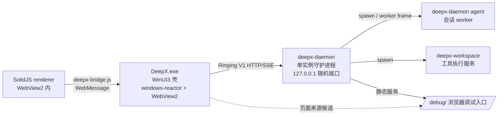

# DeepX

DeepX 是一款本地优先的 AI Agent 桌面应用，由 Rust 后端、WinUI3 原生壳 + SolidJS Web renderer 以及原生 Windows 安装与更新组件组成。

当前版本：**1.0.0-beta.8**

> **DeepX 1.0 是 DeepX-Ring 版本。**它以统一的 Ringing V1 协议与架构作为桌面端、daemon 与 worker 的正式通信基础。

> 项目仍处于 beta 阶段。API、协议和持久化格式将在若干 beta 版本验证后，随 DeepX-Ring `1.0.0` 正式版进入稳定兼容周期。

## 核心能力

- 流式模型对话、token 用量与缓存命中统计
- Ringing V1 原生控制协议：会话快照、命令确认、批量事件与 SSE 增量同步
- Ringing V1 Timeline：按会话严格排序、可持久化回放的思考、聊天与工具时间线
- Markdown 增量渲染与分段封口，避免流式半截标记造成的吞字与显示错位
- 文件、Shell、Git、Plan、Todo 和网页访问等工具
- 会话持久化、工作区管理、Skills 和子 Agent
- **WinUI3 原生桌面壳**（windows-reactor + WebView2）承载 SolidJS renderer，原生侧栏与标题栏
- 独立 Rust daemon（单实例、127.0.0.1 随机端口、discovery 文件协商）
- daemon 内置 `/debug/` 静态服务：浏览器即可打开与桌面端相同的前端调试入口
- 前端、后端和完整组件的独立打包与更新
- 统一 updater，负责修改、升级、回滚和安全卸载
- 本地优先配置、日志与审计数据

DeepX 可连接 DeepSeek、OpenAI 及其他兼容模型服务。API Key 由用户自行配置，仅用于向所选模型服务鉴权。

## 架构



- **renderer 页面来源**（`apps/winui/src/main.rs` 解析顺序）：`DEEPX_DEBUG_URL`（Vite dev server）→ 本地 renderer 目录（WebView2 虚拟主机 `https://appassets.local/`，秒开、不依赖 daemon 就绪）→ daemon 的 `/debug/`。
- **桥接**：`apps/winui/assets/deepx-bridge.js` 在 renderer 内重建 `window.deepx`，经 WebView2 WebMessage 与 Rust 侧 `bridge.rs` 通信；`bridge.rs` 使用 `deepx-client`（Ringing V1 HTTP/SSE 客户端）连接 daemon。
- **daemon 单实例**：`daemon.lock` 持有 pid 判活 + `daemon.json` discovery（endpoint/token/pid）延迟到 HTTP 就绪后发布；客户端以 pid 存活为准避免直连死端口。
- **协议**：Ringing V1（`/ringing/v1/*`，HTTP 命令/查询 + SSE 事件流 + lease 续期）。旧 legacy WebSocket 控制协议已拆除。

## 项目结构

```text
DeepX/
├── apps/
│   ├── winui/             # WinUI3 桌面壳（Rust）
│   │   ├── src/           #   main/bridge/header/sidebar/skills_view/shell_store
│   │   ├── assets/        #   deepx-bridge.js（renderer 桥注入脚本）
│   │   ├── renderer/      #   SolidJS Web renderer 源码（Vite + pnpm）
│   │   └── scripts/       #   构建、打包与桥注入脚本
│   ├── installer/         # 原生 Windows 安装器（egui）
│   └── updater/           # 统一更新、维护和卸载程序
├── crates/                # Rust workspace（17 crates）
│   ├── deepx-daemon       #   守护进程：HTTP/SSE 服务、discovery、debug 静态服务
│   ├── deepx-runtime      #   无 GUI 依赖的应用运行时（服务、workspace 监管、重建）
│   ├── deepx-msglp        #   Agent 消息循环（worker 侧）
│   ├── deepx-gate         #   模型访问与流式响应（含 gate-testui 调试页）
│   ├── deepx-ringing      #   Ringing 线上协议（envelope/ack/batch/snapshot/worker frame）
│   ├── deepx-domain       #   Ringing 领域层（DomainCommand/DomainEvent）
│   ├── deepx-client       #   Ringing V1 客户端（HTTP/SSE，壳与 TUI 共用）
│   ├── deepx-message      #   消息存储与状态机生命周期
│   ├── deepx-session      #   会话管理（单例、列表/加载/保存/活动）
│   ├── deepx-workspace    #   工具执行（库 + 独立二进制）
│   ├── deepx-skills       #   Skills 发现与生命周期
│   ├── deepx-subagent     #   子 Agent
│   ├── deepx-config       #   配置：provider 注册表、prompts、config load/save
│   ├── deepx-update       #   更新目录、规划、状态与来源引擎
│   ├── deepx-proto        #   共享数据模型与 daemon discovery
│   ├── deepx-types        #   共享类型定义
│   └── deepx-gate-testui  #   Gate 交互式调试 Web UI
├── skills/                # 项目级 Agent Skills
├── docs/                  # 协议、迁移与设计文档（含 legal/）
├── packages/              # 生成的安装包（gitignored）
├── scripts/               # 构建与版本同步脚本
├── justfile               # 统一构建入口
├── version.txt            # DeepX 单一版本号源
└── Cargo.toml             # Rust workspace
```

## 开发环境

- Windows 10/11（桌面壳与打包）
- Rust stable
- Node.js 22 或更高版本
- pnpm 11 或更高版本（renderer 使用 pnpm@11.18.0）
- [just](https://github.com/casey/just)

桌面安装包目前面向 Windows。Rust 核心组件保留跨平台构建能力，但 Linux/macOS 的桌面打包流程尚未完成。

## 快速开始

```powershell
git clone https://github.com/QAQTam/DeepX.git
cd DeepX

# 安装 renderer 依赖
just setup

# 编译后端 daemon 与 workspace
just build-daemon

# 启动 daemon（开发模式）
just dev

# 启动 renderer dev server（winui 壳以 DEEPX_DEBUG_URL 指向它）
just dev-desktop
```

运行 WinUI3 壳（开发模式，页面来自 Vite dev server）：

```powershell
$env:DEEPX_DEBUG_URL = "http://localhost:5173"
cargo run -p deepx-winui
```

无 `DEEPX_DEBUG_URL` 时，壳优先使用本地 renderer 产物（`apps/winui/out/renderer`，需先 `just build-desktop`），daemon 由桥在后台拉起。

## 构建与测试

| 命令 | 说明 |
|---|---|
| `just build-daemon` | 构建 Rust daemon + workspace（release） |
| `just build-installer` | 构建原生安装器 |
| `just build-updater` | 构建统一 updater |
| `just build-desktop` | renderer 类型检查与 Vite 构建 |
| `just build-winui` | 构建 winui 壳（release）+ 注入桥脚本 |
| `just package-winui-desktop` | 组装 winui 运行目录（完整安装包用） |
| `just winui-package` | 生成完整 Windows 安装包（等效旧 `just package`） |
| `just sfx-quick kind="full"` | SFX 快速拼接（staging 已就位时跳过构建） |
| `just check` | Rust workspace 与 renderer 静态检查 |
| `just test` | Rust 与 renderer 测试 |
| `just fmt` | Rust 格式检查 |
| `just clippy` | Rust Clippy |
| `just status` | 查看构建产物 |
| `just clean` | 清理生成文件 |

## Beta.8 协议说明

Beta.8 起，桌面端（WinUI3 壳）通过 `deepx-client` 以 Ringing V1 与 daemon 通信：

- 每个会话的事件使用严格递增 cursor；重连后可从 cursor 恢复，不依赖前端临时缓冲。
- 思考链、聊天正文和工具生命周期保留同一条时间线中的精确先后关系。
- Markdown 内容随 text delta 增量进入渲染器；区块封口只标记其完成状态，不再阻断流式展示。
- legacy WebSocket 控制协议已拆除（M3）；daemon 仅提供 `/control/v1/stop` 生命周期端点与 `/ringing/v1/*`、`/debug/*` 分流。
- daemon 以单实例运行：`daemon.lock` pid 判活、`daemon.json` discovery 延迟发布；客户端以 pid 存活为准，避免直连残留 discovery 的死端口。
- renderer 首屏并发请求由壳侧连接互斥（`bridge.rs`）收敛为单次 daemon 拉起，避免冷启动多实例并存。

## 版本管理

`version.txt` 是 DeepX 发布版本的单一来源：

```powershell
just sync-version
```

该命令会同步 Rust workspace、renderer、后端锁文件和 Release manifest URL。项目内置的版本审计脚本还会检查安装器及 Windows `DisplayVersion` 链路。

协议文档使用独立版本号，位于 `docs/legal/version.txt`。安装器会将用户同意状态、文档版本和文档哈希写入本地 `legal-consent.json`，供后续协议更新提示复用。

## 安装与更新

完整安装包由 winui 壳运行目录和 DeepX 原生安装器组装（无 Electron/NSIS 链路）。

`deepx-updater.exe` 是唯一的维护入口，统一负责：

- 前端、后端或完整组件更新
- 更新暂存、应用和回滚
- Windows“修改”入口
- 安全卸载与可选用户数据清理

独立 `uninstall.exe` 已移除。Windows 卸载注册表直接调用 updater；完整安装或修复会在验证安装根后清理旧版本遗留的兼容卸载器。

## 开发工具

- **CodeGraph**：仓库已建立符号索引（`.codegraph/`）。安装 CLI 后可直接使用：

  ```powershell
  codegraph status    # 索引状态与统计
  codegraph query <symbol>   # 符号搜索
  codegraph explore <area>   # 探索区域：相关符号源码 + 调用路径
  codegraph files     # 项目文件结构
  ```

- **`/debug/` 调试页**：daemon 运行期间，浏览器打开 `http://127.0.0.1:<port>/debug/`（端口见 `%USERPROFILE%\.deepx\daemon.json`）即可获得与桌面端相同的 renderer 与调试桥。

## 数据与隐私

DeepX 默认将配置、会话、日志和工具审计保存在当前用户的本地数据目录（Windows：`%USERPROFILE%\.deepx`）。模型请求、搜索、网页访问和在线更新仅在用户触发相关功能时访问对应第三方服务。

发布前请阅读：

- [DeepX 用户协议](docs/legal/USER_AGREEMENT.zh-CN.md)
- [DeepX 隐私政策](docs/legal/PRIVACY_POLICY.zh-CN.md)

## License

DeepX 依据 [MIT License](LICENSE) 开源。第三方组件分别适用其各自许可证。
