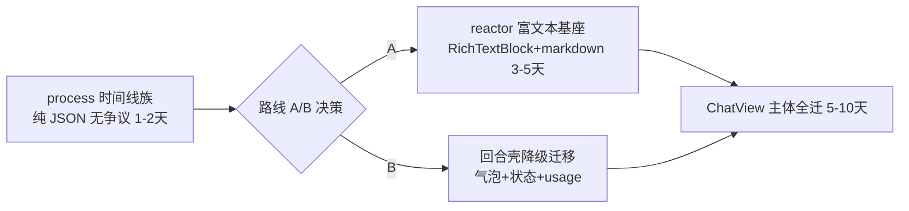

# DeepX WinUI — ChatView 迁移计划（难度评估 + 分层路线）

> 最后更新: 2026-08-07
> 前置: 壳层迁移完成（sidebar/header/home/settings/skills/info/interaction/composer）
> 关联: `ELECTRON-MIGRATION.md` 路线图 Phase 6（聊天视图迁移评估）
> 性质: **难度评估文档 + 分层路线**——ChatView 与既往迁移块的本质差异是
> "主视图单体"：XAML 无法局部嵌 WebView，无中间态，要么整块迁（需富文本
> 基座），要么整块留 Web。

---

## 结论先行

**ChatView 是全项目最难迁移块。** 难点不在状态/桥接（那些模式已成熟：
`shell_store` 投影、rev 轮询、flag 隐藏），而在 **reactor 富文本渲染基座
完全缺失**（无 RichTextBlock / 无代码高亮 / 无图表 / 无公式）。

---

## 1. 现状盘点（源码事实，已核对）

### Web 侧依赖全景

| 层 | 文件 | 依赖 | 性质 |
|---|---|---|---|
| 虚拟化 | `VirtualTurn.tsx`（97 行） | IntersectionObserver 视口挂载/卸载 + 300ms debounce | Web 专属（ListView 原生虚拟化可替代 ✓） |
| 回合组装 | `TurnGroup.tsx`（114 行）+ `turnProjection.ts`（291 行，有测试） | 气泡/状态/usage/时间戳/process 混合 | 结构可移植 Rust |
| 富文本 | `MarkdownBody.tsx`（401 行） | **marked + shiki（oniguruma WASM）+ katex（需 DOM）+ mermaid** | **全部 Web 生态** |
| 流式管线 | `markdown-render-core.ts` + `markdown.worker.ts`（37 行）+ `markdownWorkerClient.ts` | worker 线程解析 + 分段封口（stable/hash 不重渲） | 需 Rust 侧重建 |
| diff | `GitDiffPanel.tsx`（447 行）+ `diff.ts` | `renderDiffHtml` 高亮 | 部分可移植 |
| 图表 | `StreamMetricsChart.tsx`（100 行） | canvas 折线 | 可自绘（canvas 已有） |
| 结构化事件 | `ProcessTimeline/Detail/Disclosure/EventRow`（286 行）+ `processAggregation.ts`（68 行，有测试） | **纯 JSON 无富文本** | ✅ 最可迁 |
| 数据层 | `timelineMonitor.ts`（180 行）/ `sessionRegistry.ts` / `ringingStores.ts` | Web store | 终局迁移到 bridge 缓存（同 shell_store 模式） |

### reactor 能力对照（硬缺口清单）

| 能力 | reactor 现状 | 影响 |
|---|---|---|
| **RichTextBlock（行内混合排版）** | ❌ 无（仅 TextBlock 纯文本 / rich_edit_box 编辑器） | 粗体/斜体/行内代码/链接**无法原生渲染**——最大硬缺口 |
| 代码高亮 | ❌ 无（Rust 侧可引 `syntect`，需新控件/自绘） | shiki 全量迁移 |
| mermaid / graph DSL | ❌ 无（canvas/SurfaceImageSource 可自绘） | 需自绘图引擎 |
| katex 数学公式 | ❌ 无（DOM 依赖） | 降级或自绘 |
| 虚拟列表 | ✅ ListView（原生虚拟化） | VirtualTurn 替代 |
| 流式增量 | ⚠️ reactor diff 可用，但"stable 块不重渲"需 Rust 侧重建 | worker 管线重写 |
| 图片/表格 | ✅ Image / Grid 可拼 | 表格可拼，图片 OK |

---

## 2. 迁移边界（三层）

```
🔴 第 1 层（前置依赖）：reactor 富文本基座
   RichTextBlock 封装（~1-2 天/控件）→ Rust markdown 块渲染器
   （pulldown-cmark + syntect）→ 行内格式/代码块/链接
   —— 没有它，Assistant 文本只能降级纯文本

🟡 第 2 层（可迁移，1-2 天/块）：
   process 时间线族（纯 JSON，终局方向最明确）
   回合壳：用户气泡 + 状态徽标 + usage/时间戳（turnProjection 移植 Rust）
   GitDiff 文件列表头（path/change/统计；diff 高亮内容二期）

🟢 第 3 层（留 Web 或降级）：
   mermaid / graph / katex（自绘成本高，或降级占位）
   完整 GitDiff 高亮视图
```

---

## 3. 桥协议设计要点（无需新机制，复用既有模式）

- `turnProjection` / `processAggregation` 是**纯函数（291+68 行，已有测试）**，
  直接移植 Rust（同 `shell_store.rs` 的 parse_* 模式），数据流已是
  "daemon → bridge 缓存 → XAML"（timeline 事件 bridge 已透传，只需加投影）。
- 回合列表：`List<SessionTurn>` + rev（同 `session_snapshot` 模式）；增量回合
  完成/流式更新按 rev 推进。
- 流式：Rust 侧异步 markdown 管线（worker 等价物）+ 分段封口（stable 块缓存
  HTML/布局，增量 diff）——依赖第 1 层基座。
- flag：`__DEEPX_XAML__.chat = true` → ChatView 隐藏，Web 保留可回退。

---

## 4. 实施路线与决策点

### 决策点（产品拍板）

**是否接受「降级过渡」？**

| 路线 | 做法 | 代价 |
|---|---|---|
| A. 先基座后全迁（推荐） | 先立项 reactor 富文本扩展（RichTextBlock 封装 + Rust markdown 管线），齐了一次性迁 ChatView | 基座 3-5 天 + ChatView 主体 5-10 天；期间无可见进度 |
| B. 降级渐进 | 先迁 process 时间线 + 回合壳，Assistant 文本**降级纯文本**（无高亮/无图/无公式），富文本后续补 | 立即有可见迁移，但产品体验临时倒退（beta 期可接受？） |
| C. 维持现状 | ChatView 留 WebView2，全 XAML 目标只覆盖壳层 | 与"移除 Web"终局矛盾 |

### 建议顺序



**无论路线，process 时间线都先行**（结构化数据、测试齐备、终局方向明确）。

---

## 5. 工作量汇总

| 块 | 预估 | 前置 |
|---|---|---|
| process 时间线族 | 1-2 天 | 无 |
| 回合壳（气泡/状态/usage） | 1-2 天 | turnProjection 移植 |
| RichTextBlock 封装 | 1-2 天 | reactor 外部依赖（vendor 或提 PR） |
| Rust markdown 管线（pulldown-cmark + syntect） | 2-3 天 | 基座 |
| 流式增量（stable 块缓存） | 1-2 天 | markdown 管线 |
| ChatView 主体组装 + 虚拟列表 | 2-3 天 | 以上 |
| GitDiff 高亮 / mermaid / katex | 各 1-3 天 | 自绘或降级 |

## 参考

- `apps/winui/ELECTRON-MIGRATION.md` — 路线图与已交付清单
- `apps/winui/src/shell_store.rs` — parse_* 移植样板
- `apps/winui/renderer/src/presentation/` — 纯函数源（含测试）
- reactor `crates/libs/reactor/src/widgets/` — 控件清单（富文本缺口确认）
