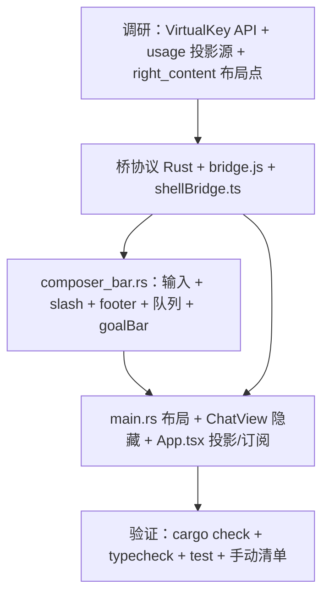

# DeepX WinUI — Composer 原生化计划（阶段 A：主输入 + footer + 队列 + goalBar）

> 最后更新: 2026-08-07
> 前置: renderer 收编完成 + 交互模态覆盖层（interaction_overlay.rs）已上线
> 关联: `ELECTRON-MIGRATION.md` 混合 XAML 路线图 Phase 4（Composer 搬迁评估）
> 原则: 复用既有迁移模式（桥协议 + rev 轮询 + flag 隐藏），一次一块，测试先行

> **实现状态：✅ 已完成（2026-08-07，T6-T10）** — `composer_bar.rs` 落地，
> 桥协议（shell.setComposer / shell.composerAction）、dashboard 快照桥侧缓存、
> Web flag 隐藏与动作分发全部就绪；`cargo check` + `pnpm typecheck` +
> `pnpm test`（266/268，2 个 SettingsView 既有失败）通过。待人工验证清单见 T10。

---

## 概述

将 Web `ComposerDock`（textarea 主输入 + slash 命令 + footer 控件 + 附件菜单 +
队列显示 + goalBar）迁移到 XAML 底部栏。**发送/停止协议请求与 followUpQueue
留在 Web**（状态单源），壳只渲染 + 提交意图回传。

这是混合 XAML 路线图 Phase 4 的第一个落地块。与已完成的交互模态覆盖层
（permission/ask）构成完整"输入 + 确认"原生闭环。

### 迁移原则

1. **草稿态壳持有，提交才进协议** — 输入框文本/附件是纯 UI 草稿，XAML 本地
   持有（`use_state`），每字符零同步（IME 原生、无延迟抖动）；仅提交时经
   `shell.composerAction` 一次性传给 Web。业务状态（会话/发送/队列）单源不变。
2. **悲观清空** — 发送成功由 Web 投影 `sendAck` 确认后壳才清空输入框；
   失败投影 `submitError`，壳显示错误且**保留文本**（对齐 Web 现有行为，
   成功路径 L107 才 `setText("")`）。
3. **附件传路径不传 base64** — 壳 STA 直调 `show_open_dialog` + 读文件，
   send action 载荷只含路径；Web 侧复用既有 `desktop.readFileBase64(path)`
   桥（与现有发送流程完全一致，避免大 base64 过 WebMessage）。
4. **行为等价 + 可回退** — 8 类交互逐个对等；`__DEEPX_XAML__.composer` flag
   关闭即回退 Web ComposerDock（组件与测试保留）。

---

## 现状盘点（源码事实，已核对）

### Web 侧现状

```
ComposerDock.tsx（283 行，ChatView.tsx L333-347 挂载）
├── goalBar = <TodoStatusStrip dashboard={entry.dashboardStore}/>（191 行，同迁）
├── ComposerQueue（12 行：排队数 + 列表 + 删除）
├── 附件预览：images（base64 + object URL）/ textFiles
├── textarea：min 62px → max 180px 自动高度；Enter 发送 / Shift+Enter 换行；
│   slash 补全（matchSlashCommands 27 行纯函数，↑↓ Esc Enter 交互）
├── submitError 行（失败保留文本）
└── footer：＋附件菜单（图片/文本）| mode 切换（plan/code）|
    PermissionLevelSelect（4 档 pill）| contextTokens/contextLimit/model 元信息 |
    发送↑/停止■（isStreaming 切换）
```

**props**（ChatView 提供）：
- `isStreaming`/`hasPendingGate`（信号）— 发送按钮 disabled / placeholder 文案
- `queue` = `createFollowUpQueue(untrack(seed), handleSend)` — 流式排队
- `onSend` = `handleSend`（stalled 恢复 → optimistic turn → `session.send_message`）
- `onStop` = `handleStop`（`session.cancel`）
- `mode`/`onModeChange`（`session.set_mode`）、`permissionLevel`/`onPermissionLevelChange`
  （`config.set_permission_level`）、`model`/`contextTokens`/`contextLimit`（usage 投影）

### 壳侧能力（已具备，零开发）

| 能力 | 位置 | 说明 |
|---|---|---|
| `show_open_dialog`（目录/文件/多选） | `bridge.rs`（STA COM） | 附件对话框直调 |
| `readFileBase64` / `readTextFile` | `bridge.rs`（desktop.* 桥已实现） | 附件读取直调 |
| `KeyboardAccelerator::new(key, modifiers, on_invoked)` | reactor `interaction.rs:191-209` | **Enter 发送方案**：绑定 TextBox，无 modifier 不匹配 Shift+Enter → 换行保留 |
| `TextBox.accepts_return` | reactor `text_box.rs:69` | 多行输入 |
| P-6 覆盖层（空 grid 穿透） | `main.rs`（splash/interaction 已验） | slash 菜单弹出层 |
| rev 轮询（`shell::poll_rev`） | `shell/mod.rs` | 状态投影 |
| `emit(kind, payload)` 事件通道 | `bridge.rs` | 壳 → Web 动作回传 |

### 关键约束（必须遵守）

1. **reactor 无 KeyDown** — Enter 拦截只能走 `keyboard_accelerator`
   （`VirtualKey::Enter` + 无 modifier）。**需手动验证**：TextBox 聚焦时
   accelerator 优先于控件内部处理、Shift+Enter 不被拦截。验证不过则降级：
   Enter 不发送（按钮发送为主），记录偏差。
2. **Flyout 仅文本内容** — slash/附件菜单用 composer 上方 P-6 覆盖层 cell
   （`grid((menu,))` + Auto 行高，与 Web `position:absolute; bottom:100%`
   语义等价），不可用 Flyout。
3. **Image 不支持 base64** — 图片预览一期**只显示文件名 + 大小**（对齐
   Web 附件的名称/大小行）；base64 预览与 `%TEMP%` 临时文件方案留阶段 B。
4. **布局**：`main.rs` right_content row0 改为内层 grid
   `WebView2(STAR) + composer(Auto)`；非 chat 视图行高 0（与 skills/home/
   settings 同模式，WebView2 常驻不销毁）。

---

## 桥协议设计（3 通道 + flag）

### 1. `shell.setComposer`（Web → 壳 invoke，rev 轮询，同 setHeader 模式）

```json
{
  "isStreaming": false,
  "hasPendingGate": false,
  "mode": "plan",
  "model": "deepseek-chat",
  "contextTokens": 12345,
  "contextLimit": 200000,
  "permissionLevel": 4,
  "queueCount": 0,
  "queueItems": [{ "id": "…", "text": "…" }],
  "submitError": "",
  "sendAck": 7
}
```

- `sendAck`：Web 每次 `handleSend` 成功（或入队）后递增 — 壳据此**清空草稿**。
- `submitError`：Web 发送失败回填（壳显示且不清空）。

### 2. `shell.composerAction`（壳 → Web emit，同 headerAction 机制）

```json
{ "action": "send", "text": "…", "imagePaths": [{"fileName":"a.png","mimeType":"image/png","path":"C:\\…"}], "textFiles": [{"fileName":"b.txt","path":"C:\\…"}] }
{ "action": "stop" }
{ "action": "mode", "mode": "plan" | "code" }
{ "action": "permission", "level": 1 | 2 | 3 | 4 }
{ "action": "queue_remove", "id": "…" }
```

Web 侧分发：send → `handleSend(text, paths→readFileBase64→imageBlocks, …)`；
stop → `handleStop`；mode → `handleSetMode`；permission → `changePermissionLevel`；
queue_remove → `queue.remove(id)`。

### 3. 附件对话框/读文件（壳直调，零 WebView 往返）

`bridge.rs` 新增 STA 方法（对齐 `pick_workspace_directory` 模式）：
- `pick_image_file() -> Result<Value, String>`（图片过滤器）
- `pick_text_file() -> Result<Value, String>`（文本过滤器）
- 读文件：复用既有 `desktop.readFileBase64/readTextFile`（invoke 路径已有）
  —— 或直接调用 Rust 侧读文件私有函数（同 STA 直调）。

### 4. flag

`window.__DEEPX_XAML__.composer = true` → ChatView 隐藏 `<ComposerDock>`
（`<Show when={!xamlComposer}>`），组件与测试保留。

---

## 实施步骤（按依赖排序，5 个任务）



### T1 — 调研确认（0.5h）

| 项 | 内容 |
|---|---|
| `VirtualKey`/`VirtualKeyModifiers` 导出 | reactor bindings 确认 `VirtualKey::Enter`、`VirtualKeyModifiers::None` 可用 |
| usage/model 投影源 | App.tsx `sessionUsage` 已有 `model`/`contextTokens`/`contextLimit` 字段 ✓（ChatView L342-344 已用） |
| dashboard 数据源 | `entry.dashboardStore`（TodoStatusStrip 同迁的数据入口） |
| `right_content` row0 改造点 | main.rs L299-322（内层 grid 两行） |
| 附件过滤器 | `show_open_dialog` 的 `SetFileTypes` 参数（图片/文本） |

### T2 — 桥协议（0.5-1h）

| 文件 | 改动 |
|---|---|
| `bridge.rs` | `ComposerState`（Deserialize，camelCase/default）+ `composer: Mutex` + `composer_rev`；`composer_snapshot`/`apply_composer`；`ComposerAction` enum（Serialize，tag=action snake_case）；`Bridge::emit_composer_action`；`Bridge::pick_image_file`/`pick_text_file`（STA）；handle_message 拦截 `shell.setComposer`；BridgeCore 初始化补字段 |
| `assets/deepx-bridge.js` | flag `composer: true` + `shell.setComposer`/`onComposerAction` |
| `shellBridge.ts` | `ComposerProjection`/`ComposerAction` 类型 + `setComposer`/`onComposerAction` |
| `electron.d.ts` | 类型声明（flag Record 加 `composer`） |

### T3 — composer_bar.rs（新组件，1-1.5 天）

```
composer_bar(cx, bridge)（chat 视图底部栏，main.rs row0 内层 grid row1）
├── goalBar：TodoStatusStrip 投影区（dashboard 快照，rev 轮询同 home_view）
├── queue 行：queueCount>0 时 "n 条后续任务已排队" + items + 删除按钮
├── slash 菜单（P-6 覆盖层 cell，composer 上方）：matchSlashCommands 移植
│   到 Rust（常量表 + startsWith 过滤）；↑↓ Esc Enter 键盘导航
├── 卡片（LayerFill + 圆角 8px，对齐 .composer-dock 视觉）：
│   ├── TextBox（accepts_return，placeholder 随 hasPendingGate 切换）
│   │   └── KeyboardAccelerator(Enter, None, submit) ← T1 验证
│   ├── submitError 行（投影，SystemCritical 文本）
│   ├── 附件预览行（文件名 + 大小 + ×移除；壳本地态）
│   └── footer：＋附件菜单（图片/文本→STA 对话框）| mode 切换 |
│       PermissionLevelSelect（4 档 pill 移植）| token/model 元信息 |
│       发送↑/停止■
└── 本地态：text/attachments/attachOpen/selectedSlashIndex/dismissedSlashValue
    （草稿纯 UI 态；seed 变化重置——同 interaction_overlay last_key 模式）
```

### T4 — 接线（0.5-1h）

| 文件 | 改动 |
|---|---|
| `main.rs` | right_content row0 内层 grid（WebView STAR + composer Auto），非 chat 行高 0 |
| `ChatView.tsx` | `<Show when={!xamlComposer}>` 包裹 ComposerDock（L333-347） |
| `App.tsx` | 投影 effect（usage/mode/permissionLevel/queue/sendAck/submitError → `setComposer`）；`onComposerAction` 订阅分发（send→handleSend 路径：附件路径经 `desktop.readFileBase64/readTextFile` 转 base64/content；stop/mode/permission/queue_remove → 既有 handler） |

### T5 — 验证

- `cargo check -p deepx-winui`；`pnpm typecheck`；`pnpm test`（268 基线，
  2 个 SettingsView 失败为既有，stash 对比确认）
- 手动清单（空闲实例）：
  1. Enter 发送 / Shift+Enter 换行（accelerator 验证）
  2. 中文 IME 组合输入无抖动
  3. 发送成功 `sendAck` 后清空；失败保留文本 + 错误显示
  4. slash 补全：/ 触发、↑↓ 导航、Esc 关闭、Enter 选中
  5. 附件：图片/文本选择、预览行、移除；发送载荷含路径
  6. 流式时发送变停止；排队显示与删除
  7. mode 切换 / 权限 pill 回传 Web 生效
  8. 会话切换草稿重置；flag 关闭回退 Web 行为不变

---

## 偏差记录（复刻偏差，落库时核对）

- textarea 62→180px 自动高度 → TextBox 固定高度（MaxHeight + 滚动），记录偏差
- 毛玻璃（backdrop-filter）→ LayerFill + 圆角（壳内统一，同 info_panel）
- 图片预览（object URL）→ **阶段 B 完成**：`%TEMP%/deepx-preview-*` 副本 +
  `Image::new_with_uri(file://)` 缩略图（48x48 UniformToFill），移除/清空时删除；
  FileOpenPicker（Win11 新视觉）列入全 XAML 终局待办（reactor 无 HWND 封装）
- 附件菜单/slash 菜单 absolute 定位 → P-6 覆盖层 cell

## 参考

- `apps/winui/ELECTRON-MIGRATION.md` — 路线图与已交付清单（含既有迁移模式原则）
- `apps/winui/REPORT-NATIVE-STATE-ARCHITECTURE.md` — 数据通道架构诊断
- `apps/winui/PLAN-NATIVE-STATEMACHINE.md` — 状态机迁移计划（S1/S2/S3）
- `apps/winui/src/interaction_overlay.rs` — P-6 覆盖层 + 本地态重置样板
- `apps/winui/renderer/src/components/composer/` — Web 现状（组件与测试保留）
- reactor `interaction.rs:191-209` — KeyboardAccelerator API
