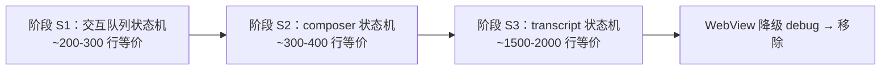

# DeepX WinUI — 状态机迁移计划（Web → Rust 直连）

> 最后更新: 2026-08-07
> 前置: `REPORT-NATIVE-STATE-ARCHITECTURE.md`（架构诊断：传输已原生、状态机借 Web）
> 目标: 将"会话运行态状态机"从 Web store 迁至 Rust（bridge 直解析），
> 使 XAML 不再借用 WebView 能力——WebView 最终降级为纯 debug 入口并移除。

---

## 总览

三阶段迁移，按状态机规模递增、风险递增。每阶段完成后对应 `shell.set*`
的"Web 投影"变为"Rust 直解析"（**桥形状不变**，无需返工）。



**过渡模式（每阶段通用）**：Rust 直解析与 Web 投影**并存**（双通道），
flag 切换验证；行为等价确认后切直连、Web 侧代码保留可回退。

---

## 阶段 S1：交互队列状态机（最小闭环示范）

### 范围

`pendingInteractions` 的组装逻辑（现在在 Web：daemon control/conversation 事件
→ `ringingStores` reducer → `sessionSelectors.activeInteraction` → 投影）。

### 数据流（迁后）

```
daemon 交互事件（TimelineToolPermission / ask / plan 类）
  → bridge.rs emit_batch 拦截解析
  → Rust 交互队列（Vec<InteractionItem> + rev）
  → interaction_overlay.rs 直读快照（不经 Web）
```

### 桥变化

| 现状 | 迁后 |
|---|---|
| `shell.setInteraction`（Web 投影） | 移除（壳直解析）；flag 关闭时 Web 仍走自己投影（回退） |
| `shell.interactionAction`（壳→Web 回传） | **不变**（协议请求仍在 Web？→ 见决策点 D1） |

### 关键决策点

- **D1 响应出口**：交互响应（interaction.permission/ask_response/plan_review）
  是 daemon 协议请求。迁 S1 时协议请求也应迁 Rust（`deepx-client` action
  直发），否则"状态机原生、出口仍借 Web"。**建议一并迁**（动作是简单
  action 调用，规模小）。
- D2 队列多会话：pendingInteractions 是 per-seed——Rust 队列按 seed 分桶。

### 验证

- Web reducer 测试（`ringingStores.test.ts` 交互用例）翻译为 Rust 单元测试
- cargo check + typecheck + test 基线
- 手动：权限/ask/plan 三模板弹出与响应，双通道 A/B 无差异

### 工作量：1-2 天

---

## 阶段 S2：composer 状态机

### 范围

`isStreaming` 判定（sessionSelectors）、`followUpQueue`（37 行）、
`usage` 实时值（rawSession/sessionPresentation）、queue 组装。

### 数据流（迁后）

```
daemon 事件（turn_started/delta/usage_updated…）
  → bridge 解析（复用 emit_batch）
  → Rust ComposerState 直组装（is_streaming/gate/queue/usage…）
  → composer_bar.rs 直读
```

### 桥变化

| 现状 | 迁后 |
|---|---|
| `shell.setComposer`（Web 投影） | 移除（Rust 直组装）；回退保留 |
| `shell.composerAction`（send/stop/mode/permission/queue_remove） | 迁 Rust 直发（deepx-client action/command），send 附件读取 Rust 直做 |

### 关键点

- **send 乐观更新**（optimistic turn）：现在在 Web handleSend——迁 Rust 后
  transcript 状态机（S3）负责，S2 阶段 send 直发 daemon 即可（乐观更新
  随 S3 落地，期间行为差异记录）。
- **telemetry 采集**（顺手项）：在 S2 补 usage_updated 样本累积，
  stats 图表复活为 Rust 直连数据。

### 验证

- followUpQueue/sessionSelectors 测试翻译 Rust
- 手动：流式发送/停止/排队/附件全链路

### 工作量：1-2 天

---

## 阶段 S3：transcript 状态机（最大块）

### 范围

增量事件组装（ringingStores 894 行等价：turn_started/round_delta/封口）、
gap 恢复（timelineMonitor）、乐观更新、turnProjection/processAggregation/
toolSemantics 投影（已有测试，纯函数直接翻译）。

### 前置

- reactor 富文本基座（渲染侧，见 `PLAN-NATIVE-CHATVIEW.md`）
- S1/S2 的 bridge 解析管道复用

### 数据流（迁后）

```
daemon timeline/conversation 事件 → bridge transcript 组装
  → XAML ChatView（ListView 虚拟化 + 富文本块渲染）
  → 发送/停止/undo/compact 全部 Rust 直发
```

### 桥变化

`shell.setInteraction`/`setComposer` 已移除；新增 transcript 快照
（`transcript_snapshot(seed) -> (Vec<Turn>, rev)`，同 shell_store 模式）；
WebView 不再承载会话状态。

### 工作量：5-10 天（含测试移植）

---

## 依赖与风险

| 项 | 说明 |
|---|---|
| S1 无外部依赖 | 最小启动点 |
| S2 依赖 S1 管道模式 | 复用 emit_batch 解析 + rev 快照 |
| S3 依赖富文本基座 | 渲染侧前置（另立项） |
| 行为等价风险 | 双通道 A/B 过渡 + 测试翻译兜底 |
| Web 侧保留 | 每阶段回退 flag，Web 代码不删（直至全部迁完统一清理） |

## 建议执行顺序

1. **S1 立即启动**（示范闭环，1-2 天）
2. S2 紧随（含 telemetry 采集，复活 stats）
3. 富文本基座立项（与 S3 并行）
4. S3 最后（最大块，需基座就绪）

## 参考

- `REPORT-NATIVE-STATE-ARCHITECTURE.md` — 诊断与量化
- `PLAN-NATIVE-CHATVIEW.md` — transcript 渲染侧评估
- `apps/winui/src/bridge.rs` — emit_batch/parse_* 既有管道
- `apps/winui/renderer/src/store/` — Web 状态机源（测试可翻译）
