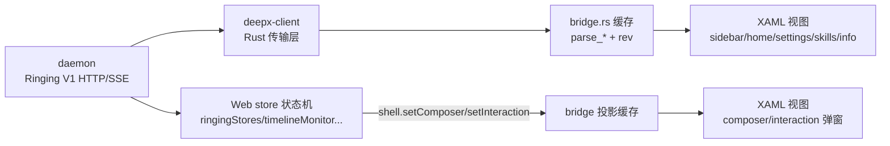
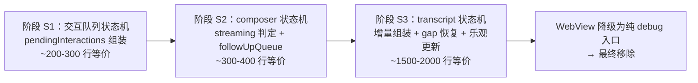

# DeepX WinUI 壳数据通道架构调查报告
## ——XAML 原生框架：直连后端，还是借用 WebView 能力？

> 编制: 2026-08-07 | 性质: 架构诊断（针对"移除 Web、全 XAML 原生"终局目标）

---

## 1. 核心结论

**当前是混合架构：传输层已原生，会话运行态的状态机借 Web。**

- **壳层数据**（会话列表/用量/skills/dashboard/设置读写）：Rust `deepx-client`
  **直连 daemon**，不借 WebView——这是"原生"的。
- **会话运行态**（composer 的 streaming/队列、交互队列 pendingInteractions、
  未来 transcript）：状态机在 **Web store 层**，壳通过 `shell.set*` 投影消费——
  这是"借用"。

**尖锐矛盾**：只要状态机还在 Web，WebView2 就承担"后台状态机"角色——
**即使 UI 全部 XAML，WebView 也无法移除**。终局的真正障碍不在 UI 渲染，
在状态机归属。

---

## 2. 现状解剖（按数据通道分类）

| XAML 组件 | 数据来源 | 通道本质 |
|---|---|---|
| sidebar（会话列表/活动） | `deepx-client` → `shell_store.rs` 缓存 → rev 轮询 | ✅ Rust 直连 |
| home（首页） | 同上（session_snapshot） | ✅ Rust 直连 |
| settings（config/tools/workspace） | `spawn_config_load/save` → client 查询 | ✅ Rust 直连 |
| skills（技能页） | control 频道 `skills_updated` → bridge 解析 | ✅ Rust 直连 |
| info（用量/任务区块） | `client.bootstrap` + `dashboard_snapshot` 事件解析 | ✅ Rust 直连 |
| composer（状态投影） | daemon → **Web store** → `shell.setComposer` → bridge → XAML | ⚠️ 借 Web |
| 交互弹窗（pendingInteractions） | daemon → **Web store** → `shell.setInteraction` → bridge → XAML | ⚠️ 借 Web |
| transcript（未迁） | Web store 独占 | 🔴 依赖 |

**命令出口**（resume/delete/new_session/config.save/send/stop）：BridgeCore →
`deepx-client` → daemon，全部原生 ✓。

---

## 3. 为什么是混合（历史必然）

Web renderer 是 Electron 时代的原始客户端，其 store 层是**唯一完整的会话
状态机**（增量事件组装、gap 恢复、乐观更新、卡死判定、排队）。壳迁移时
定下"状态单源在 Web、壳只渲染"原则——每块迁移都务实（行为等价 + 可回退），
但状态机本身从未搬迁，形成今天的"投影中转"格局。

---

## 4. 借用部分真实规模（量化）

Web 状态机 ≈ **2745 行 TS**（2026-08-07 实测）：

| 文件 | 行数 | 职责 |
|---|---|---|
| `ringingStores.ts` | 894 | 增量事件组装（control/conversation/tool 三频道 reducer）——最大块 |
| `sessionPresentation.ts` | 341 | 会话展示投影 |
| `rawSession.ts` | 280 | 原始会话模型 + 初始状态 |
| `turnProjection.ts` | 291 | 回合视图模型（纯函数，有测试） |
| `timelinePresentation.ts` | 248 | 时间线展示投影 |
| `toolSemantics.ts` | 204 | 工具语义（纯函数，有测试） |
| `timelineMonitor.ts` | 180 | 时间线游标/gap 恢复管理 |
| `sessionRegistry.ts` | 120 | 会话注册表 |
| `ringingSse.ts` | 91 | SSE 传输封装（Rust 侧 deepx-client 已有等价） |
| `processAggregation.ts` | 68 | process 聚合（纯函数，有测试） |
| `followUpQueue.ts` | 37 | 流式排队 |

**关键事实**：传输层（SSE/lease/gap 恢复）`deepx-client` 已原生实现；
`ringingSse.ts`（91 行）**无需迁移**。真正要迁的是**状态组装与投影语义**
（约 2000+ 行等价逻辑）。

---

## 5. 终局路径与演进路线

每阶段完成后，对应 `shell.set*` 的"投影"就变成"Rust 直解析"——**数据源
替换，桥形状不变**（当初桥协议设计刻意保持此性质，无需返工）。

**前置依赖**（与状态机迁移并行）：
- reactor 富文本基座（transcript 渲染，S3 的 UI 侧前提）
- telemetry 采集补全（stats 图表复活为 Rust 直连数据，顺手项）

**风险**：
- S3 最大：增量事件组装语义复杂（ringingStores 894 行 + 三频道联动），
  需移植测试（Web 侧已有 reducer 测试可对照翻译）
- 行为等价验证：每阶段以"flag 回退 + 双通道并存"过渡（Rust 直解析与
  Web 投影可 A/B 对比，验证后切换）

---

## 6. 结论与建议

1. **壳层已经是原生**——"直连 vs 借用"不是全有全无，是 8:2 的现状；
2. 借用的 20%（会话运行态状态机）是**移除 Web 的最后障碍**，也是唯一障碍；
3. **建议从 S1（交互队列）启动**：规模最小、闭环最快（daemon 事件 →
   Rust 组装 → XAML 弹窗直读），验证"状态机迁移"模式后放大到 S2/S3；
4. 全 XAML 终局 = 富文本基座（渲染）+ 状态机迁移（数据）+ 壳能力补齐
   （托盘/更新/优雅退出），三大支柱，S1 是最佳切入点。

## 参考

- `ELECTRON-MIGRATION.md` — 迁移总览与已交付清单
- `PLAN-NATIVE-CHATVIEW.md` — transcript 渲染侧难度评估
- `PLAN-NATIVE-STATEMACHINE.md` — 状态机迁移执行计划（本报告的实施文档）
