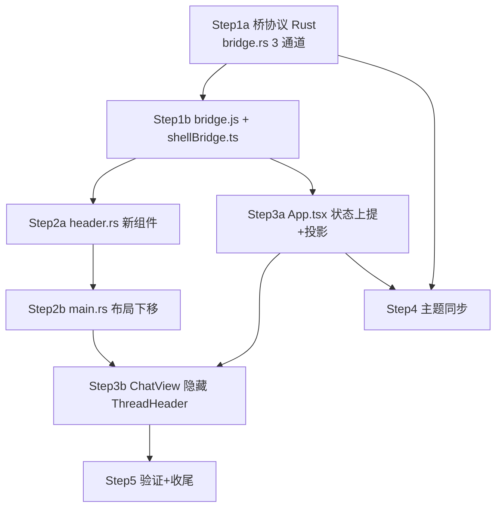

# DeepX WinUI — P0 标题栏原生化：具体工作流（落地版）

> 基于 `PLAN-NATIVE-UI.md`（架构决策）的**可执行工作流**。
> 编制日期: 2026-08-06，源码快照核对完毕。
> ⚠️ 约束：**不得终止/重启正在运行的 DeepX (PID 10456) 与 deepx-daemon 进程**；
> 所有验证均为编译/静态检查（`cargo check` / `pnpm typecheck` / `pnpm test`），
> 手动验证清单由人工在空闲实例上执行。

---

## 0. 源码事实（已核对，含规划文档未写明的细节）

### 框架能力（外部 `windows-reactor`，零开发）
| 能力 | 位置 | 备注 |
|---|---|---|
| `TitleBar` 控件：title/subtitle/**content 槽**/**footer 槽**/tall/back/pane_toggle | `F:/windows-rs-master/.../reactor/src/widgets/title_bar.rs`（83 行） | `content`→`TitleBar.Content`，`footer`→`RightHeader`（L76-82） |
| 自动接线 `SetExtendsContentIntoTitleBar(true)` + `SetTitleBar(tb)` | `reactor/src/host.rs:277-288` | root 每次变化时执行；**只要渲染树出现 TitleBar 即生效** |
| 标题栏主题自动（ActualTheme → `SetPreferredTheme`） | `host.rs:89-106` | 深色自动，无需手写 |
| `App::set_requested_theme(theme)` / 模块级 `set_requested_theme` | `host.rs:326` / `host.rs:24` | Step 4 用 |
| `use_color_scheme()`（ActualThemeChanged 驱动重渲染） | `reactor/src/engine.rs:732-738` | Step 4 壳侧监听主题变化 |
| `find_titlebar`（每窗口第一个） | `reactor/src/backend/winui/mod.rs:238` | 本窗口唯一，无冲突 |

### 桥协议现状（`apps/winui/src/bridge.rs`，1058 行）
- **线程模型**：`BridgeCore`（tokio 侧，Send+Sync，含 `outbox_tx`）↔ `Bridge`（STA UI 线程，含 WebView + `outbox_rx`）。
- **出向通道**：`emit(kind, payload)` → mpsc → `pump()`（main.rs 50ms timer）→ `post_web_message_as_json`。**壳 → Web 无 invoke，只有事件**（`shell.navigate` 即此模式）。
- **入向通道**：`handle_message`（L817）按序拦截：`log` → `desktop.openDevTools`（STA 开 DevTools 窗口，L842-848）→ `desktop.openDialog/openImageDialog`（STA COM 对话框，L852-875）→ 其余 `spawn_invoke`。
- **`BridgeCore::invoke` 本地 desktop 实现**（L470-535）：`openPath`→`open_external(target)`（L515-522）、`togglePet/getPetStatus`→`false`（L523，壳 stub 已存在）、`openDevTools`→Err 提示必须 UI 线程（L528-531）。
- **侧栏 rev 模式**（header 照抄）：`session_rev: AtomicU64` + `session_snapshot()` + sidebar 500ms timer 比对（sidebar.rs:150-165）。
- **可复用私有函数**：`show_open_dialog`（目录选择，STA）、`open_external`（资源管理器打开）、webview `open_dev_tools_window`。

### Web 侧现状
- `deepx-bridge.js`（112 行）：`invoke/sub/emit` 机制 + **flag 注入模式** `window.__DEEPX_XAML_SIDEBAR__ = true`（L56）；`shell` 目前仅 `onNavigate`（L85-89）；`desktop` 已有 `openDialog/openImageDialog/openPath/openDevTools/togglePet/getPetStatus`。
- `shellBridge.ts`（25 行）：`isXamlSidebar()` + `onNavigate()`，浏览器 debug 时返回 undefined 优雅降级。
- `ChatView.tsx`：L201-226 渲染 `<ThreadHeader>`；**`infoOpen`/`statsOpen` 是 ChatView 本地 signal（L100-101）——壳 headerAction 无法触达，必须状态上提**（规划文档未写明的关键改动）。
- `App.tsx`：`xamlSidebar` flag（L65）+ `onNavigate` 挂接（L505-511）+ `applyTheme`（L57-59）/`switchTheme`（L496-500）+ ChatView 挂载点（L748-771）+ `browseWorkspace`（L474 附近，内部 `workspace.set`）。
- `ThreadHeader.tsx`：8 个按钮（workspace/location/console/info/stats/undo/compact/pet）。

---

## 1. 工作流总览（按依赖排序，8 个任务）



---

## 2. 任务明细

### T1 — Step 1a：桥协议 Rust 侧（`apps/winui/src/bridge.rs`）

**改动点（按序）**：

1. `BridgeCore` 新增字段（L63-77 结构体）：
   ```rust
   /// XAML 标题栏数据源：Web `shell.header` 状态投影（原样 JSON）。
   header_state: Mutex<Value>,
   /// 标题栏状态版本：Web 推送后递增，UI 侧 timer 比对后刷新。
   header_rev: AtomicU64,
   ```
2. `BridgeCore` 新增方法（对齐 sessions 模式）：
   - `pub fn header_snapshot(&self) -> (Value, u64)` — UI 侧 timer 读取。
   - `pub fn apply_header(&self, payload: Value)` — 存状态 + `header_rev.fetch_add(1)`。
3. `handle_message`（L817）在 openDialog 拦截**之后**、`spawn_invoke`（L876）**之前**插入两个拦截分支：
   - `shell.setHeader` → `core.apply_header(params)` + `respond(id, true, json!(null), None)`（Web 状态投影，不进 client）。
   - `shell.setTheme` → `windows_reactor::set_requested_theme(...)`（L24 模块级函数）+ respond。（映射：`"light"→Light`，`"dark"|"dark-gray"→Dark`。）
4. `Bridge`（STA 侧）新增 3 个透传方法（供 header.rs 使用，同 sidebar 的 `spawn_*` 模式）：
   - `pub fn pick_workspace_directory(&self) -> Result<Value, String>` — 调私有 `show_open_dialog(true, false, false, None)`（目录模式，STA 线程直接调用，COM 安全）。
   - `pub fn open_path(&self, target: &str)` — 调 `open_external(target)`（bridge.rs:520 复用）。
   - `pub fn open_devtools(&self)` — 复用 L842-848 的 webview 打开逻辑。
5. **壳 → Web 通道**：不新建 invoke 机制，沿用 `emit` 事件（与 `shell.navigate` 完全一致）——header.rs 点击时 `core.emit("shell.headerAction", json!({"action": ..., "path": ...}))`。
   > ⚠️ 与规划文档的偏差：规划表标 `shell.headerAction` 为 "invoke"，但壳 → Web 无 invoke 通道；事件机制行为等价（本地 IPC <1ms），且 Web 侧订阅模型与 `onNavigate` 一致。**载荷扩展 `path?`**：workspace 按钮壳选完目录后把路径带回 Web，Web 才能执行 `workspace.set`（规划文档未写明的必要扩展）。

**验证**：`cargo check -p deepx-winui`（不影响运行中的 daemon）。

---

### T2 — Step 1b：桥 JS 层（`assets/deepx-bridge.js` + `renderer/src/runtime/shellBridge.ts`）

**`deepx-bridge.js`**：
1. L56 旁注入第二个 flag：`window.__DEEPX_XAML_HEADER__ = true;`（与 sidebar 同模式，可回退）。
2. `shell` 对象（L85-89）扩展：
   ```js
   shell: {
     onNavigate: ...,
     setHeader: function (state) { return invoke('shell.setHeader', state || {}); },
     onHeaderAction: function (l) { return sub('shell.headerAction', l); },
     setTheme: function (mode) { return invoke('shell.setTheme', { mode: mode }); },
     onThemeChanged: function (l) { return sub('shell.themeChanged', l); }
   }
   ```

**`shellBridge.ts`**（25 行 → ~70 行）：
```ts
export interface HeaderState {
  view: "home" | "chat" | "skills" | "settings";
  title: string;
  workspace: string;
  infoOpen: boolean;
  statsOpen: boolean;
  compacting: boolean;
  compactDisabled: boolean;
  undoDisabled: boolean;
  petEnabled: boolean;
}
export interface HeaderAction { action: "workspace" | "location" | "console" | "info" | "stats" | "undo" | "compact" | "pet"; path?: string; }
export function isXamlHeader(): boolean;          // __DEEPX_XAML_HEADER__
export function setHeader(state: HeaderState): Promise<unknown> | undefined;
export function onHeaderAction(l: (a: HeaderAction) => void): (() => void) | undefined;
export function setTheme(mode: ThemeMode): Promise<unknown> | undefined;
export function onThemeChanged(l: (mode: "light" | "dark") => void): (() => void) | undefined;
```
（全部遵循 `onNavigate` 的优雅降级：`window.deepx?.shell` 不存在返回 undefined。）

**验证**：`pnpm -C apps/winui/renderer typecheck`。

---

### T3 — Step 2a：壳侧 header 组件（新文件 `apps/winui/src/header.rs`）

对齐 sidebar.rs 的组件模式（`use_state` + `use_ref` + timer + rev 比对）：

1. **结构**（`pub fn header(cx, bridge, ...) -> Element`）：
   ```
   TitleBar (SetTitleBar 拖拽区，host 自动接线)
   ├── title 槽：TextBlock（会话标题 / 视图名，SecondaryText 风格）
   └── footer 槽：hstack( ①workspace ②location ③console ┃ ④info ⑤stats ⑥undo ⑦compact )
        —— ⑧pet 不渲染（壳 stub 恒 false，规划决策）
   ```
   - 按钮统一 `button("").icon(Icon::symbol(Symbol::X)).subtle().tooltip(...)`（复用 sidebar 的 `icon_button` 模式，L36-42）。
   - Symbol 映射：①`OpenLocal` ②`OpenFile` ③`DeveloperTools` ④`Info` ⑤`Diagnostic` ⑥`Undo` ⑦`Compress`。
   - ④⑤ 的 active 态用 `ThemeRef::AccentSecondary` 前景/背景（对齐 Web `active` class 语义）；⑥⑦ 的禁用态由 header_state 驱动（`undoDisabled`/`compacting`+`compactDisabled`，Web 语义逐一对等）。

2. **状态同步**：`DispatcherTimer(500ms)` 轮询 `core.header_snapshot()`，rev 变化才 `set_state`（照抄 sidebar.rs:150-165）。

3. **点击分发**（行为等价 Web）：
   | 按钮 | 处理 | 实现 |
   |---|---|---|
   | ①workspace | 壳弹目录对话框 → 路径回传 | `bridge.pick_workspace_directory()` → `emit("shell.headerAction", {action:"workspace", path})`；对话框取消 → 不发 |
   | ②location | 壳直接 | `bridge.open_path(header_state.workspace)`（空则不响应） |
   | ③console | 壳直接 | `bridge.open_devtools()` |
   | ④info ⑤stats | 回传 Web 翻转 | `emit("shell.headerAction", {action:"info"\|"stats"})` |
   | ⑥undo ⑦compact | 回传 Web 执行 | `emit("shell.headerAction", {action:"undo"\|"compact"})`（禁用态不触发） |

**验证**：`cargo check`。手动（人工）：标题栏出现、拖拽、双击最大化、Mica 延伸（清单见 §4）。

---

### T4 — Step 2b：布局（`apps/winui/src/main.rs`）

`app()`（L27-95）Grid 改两行：
```
grid((
    header.grid_row(0).grid_column(0),   // 跨两列
    grid((nav, webview)).grid_row(1).grid_column(0),  // 原双栏下移
))
.rows([GridLength::Pixel(48.0), GridLength::STAR])
.columns([...])  // 原 columns 移到子 Grid
```
- `GridLength::Pixel(48.0)` 固定高（Web ThreadHeader 58px → XAML 48px，规划文档既定）。
- WebView2 从 row 1 开始 → 与拖拽区无输入重叠（host.rs:277-288 自动接线，无需手动 SetTitleBar）。
- TitleBar 需要 `.tall(false)`（默认）。

**验证**：`cargo check`；人工验证标题栏交互。

---

### T5 — Step 3a：Web 状态上提 + 投影（`renderer/src/App.tsx`）

1. **状态上提**（规划文档未写明，但必须）：
   - `infoOpen`/`statsOpen` 从 ChatView（L100-101）上提到 App：`const [infoOpen, setInfoOpen] = createSignal(false)`，作为 props 传入 ChatView（受控），`onToggleInfo`/`onToggleStats` 由 App 提供。
   - ChatView 内 3 处引用同步改为 props（L205-206 传参、L227/L238 Show 条件）。

2. **header 状态投影 effect**（onSettled 内，挂接在 L505 `onNavigate` 附近）：
   ```ts
   createEffect(() => {
     const entry = activeEntry();
     setHeader({
       view: view(),
       title: view() === "chat" ? (entry?.state().session.title || activeSeed().slice(0, 8)) : viewName(view()),
       workspace: workspaceDraft(),          // App 已有（L78）
       infoOpen: infoOpen(), statsOpen: statsOpen(),
       compacting: entry?.state().compact.active ?? false,
       compactDisabled: entry?.state().streaming ?? false,   // 与 ChatView L212 同源
       undoDisabled: (entry?.state().turns.length ?? 0) === 0 || (entry?.state().streaming ?? false),  // 与 L214 同源
       petEnabled: false,
     });
   });
   ```
   > SolidJS createEffect 自动依赖追踪：任一信号变化即重发；壳侧 rev 比对只重渲染变化帧，无需节流。

3. **`shell.headerAction` 订阅分发**（onSettled 内）：
   ```ts
   unlistenHeaderAction = onHeaderAction(a => {
     if (a.action === "workspace" && a.path) { void browseWorkspace(a.path); }   // browseWorkspace 已有（L474），带参设置
     else if (a.action === "info") setInfoOpen(v => !v);
     else if (a.action === "stats") setStatsOpen(v => !v);
     else if (a.action === "undo") void undoLastTurn();
     else if (a.action === "compact") { /* 需触发 ChatView 的 handleCompact：见下 */ }
     // location/console 壳已处理，Web 忽略
   });
   ```
   - **compact 的触达路径**：`handleCompact` 在 ChatView 内部（L172-174，`session.compact` 请求）。方案：ChatView 加 prop `onHeaderCommand`，或把 compact 也上提。**推荐**：App 通过 `registry.get(seed)?.ui` 无此能力 → 给 ChatView 传 `onCompactExternal` prop（`useRef` 注册回调），App 分发时调用；ChatView 卸载时注销。改动最小（ChatView +2 行）。

4. **`switchTheme`（L496-500）与 `applyTheme`（L57-59）扩展**：`applyTheme` 末尾调 `setTheme(resolveTheme(mode))`（`dark-gray`→`"dark"` 映射，见 T7）；`onThemeChanged` 订阅校正（T7）。

**验证**：`pnpm -C apps/winui/renderer typecheck`。

---

### T6 — Step 3b：ChatView 隐藏 ThreadHeader（`renderer/src/components/ChatView.tsx`）

- L201-226：`<Show when={!xamlHeader}>` 包裹 `<ThreadHeader .../>`（`xamlHeader = isXamlHeader()`，import 自 shellBridge）。
- infoOpen/statsOpen 改受控 props（T5 联动）：`<Show when={props.infoOpen}>` / `<Show when={props.statsOpen}>`。
- 新增 `onCompactExternal` prop 注册（T5 联动）。
- **ThreadHeader.tsx / ThreadHeader.test.tsx 不动**（flag 回退路径保留）。

**验证**：`pnpm -C apps/winui/renderer typecheck && pnpm -C apps/winui/renderer test`（262+ 基线不降）。

---

### T7 — Step 4：主题同步（双向）

| 方向 | 实现 |
|---|---|
| Web → 壳 | `applyTheme`/`switchTheme` 调 `shell.setTheme(resolveTheme(mode))`；映射 `light→"light"`，`dark`/`dark-gray→"dark"`；`system` 时按 `prefers-color-scheme` 解析后推送（App.tsx:52-55 已有 resolveTheme） |
| 壳 → Web | `shell.setTheme` 拦截后：`windows_reactor::set_requested_theme(...)`；壳侧监听 `use_color_scheme()`（engine.rs:732）或 `ActualThemeChanged`（host.rs:89 链路已有），变化时 `emit("shell.themeChanged", {"mode": ...})` |
| Web 校正 | `onThemeChanged(mode)` → 若用户主题为 `system`，`applyTheme("system")` 重新解析（L516-521 已有 media 监听，与壳事件互为冗余保险） |

**验证**：三套 Web 主题 ↔ 壳标题栏/侧栏一致；系统切换双向同步（人工）。

---

### T8 — Step 5：验证 + 收尾

1. `cargo check -p deepx-winui`（winui crate 独立检查，不启动 daemon）。
2. `pnpm -C apps/winui/renderer typecheck && pnpm -C apps/winui/renderer test`。
3. 全仓 `rg "ThreadHeader|xamlHeader|headerAction|shell.header"` 核对无遗漏、无双写。
4. README（apps/winui）目录结构补 `header.rs`（如需）。
5. 人工验证清单（§4）——**在空闲实例执行，不触碰现有 DeepX/daemon**。

---

## 3. 与规划文档的偏差记录（源码核对后）

| # | 规划文档 | 落地决策 | 原因 |
|---|---|---|---|
| D1 | `shell.headerAction` 为 "壳→Web invoke" | 壳→Web 走 **emit 事件**（`shell.navigate` 同机制） | 桥无反向 invoke 通道；行为等价 |
| D2 | ①workspace "壳直接处理 openDialog" | 壳弹框 + **path 回传 Web**（`{action, path?}`），Web 执行 `workspace.set` | 工作区状态单一数据源在 Web（App.tsx browseWorkspace） |
| D3 | （未提及）info/stats 状态 | **上提 App 受控 props** | ChatView 本地 signal 无法被壳 headerAction 触达 |
| D4 | （未提及）compact 触发 | ChatView 注册 `onCompactExternal` 回调，App 分发 | handleCompact 在 ChatView 内部（session.compact 请求） |
| D5 | `shell.theme` 双向 | Web→壳 `setTheme` invoke（T1 拦截）；壳→Web `themeChanged` 事件；`dark-gray→dark` 映射 | 壳仅两态，Web 三态 |

---

## 4. 人工验证清单（用户执行，不干扰运行实例）

- [ ] 标题栏：拖拽移动、双击最大化/还原、右键系统菜单
- [ ] Mica 延伸到标题栏（无白色系统条）；深浅色切换标题栏随动
- [ ] ①workspace：弹目录对话框；取消无副作用；选择后 Web 工作区切换生效（标题栏 workspace 状态同步）
- [ ] ②location：资源管理器打开会话目录；③console：DevTools 窗口
- [ ] ④info ⑤stats：面板开合与 Web 内一致（active 态在标题栏同步高亮）
- [ ] ⑥undo：undoDisabled 时壳按钮禁用；⑦compact：compacting 时禁用 + "整理中" 态
- [ ] ⑧pet：壳无入口
- [ ] 会话切换：标题随 shell.header 更新；home/skills/settings 显示视图名
- [ ] 主题：三套 Web 主题 ↔ 壳一致；系统切换双向同步
- [ ] 浏览器 debug 模式（无 window.deepx）：ThreadHeader 回退显示（flag 关闭路径）
- [ ] 回归：侧栏（Phase 2）行为不变

---

## 5. 预估改动量

| 文件 | 类型 | 量级 |
|---|---|---|
| `apps/winui/src/bridge.rs` | 改 | +~60 行 |
| `apps/winui/src/header.rs` | 新 | ~200 行 |
| `apps/winui/src/main.rs` | 改 | ~15 行 |
| `apps/winui/assets/deepx-bridge.js` | 改 | ~10 行 |
| `renderer/src/runtime/shellBridge.ts` | 改 | ~50 行 |
| `renderer/src/App.tsx` | 改 | ~60 行 |
| `renderer/src/components/ChatView.tsx` | 改 | ~20 行 |

合计 ~1 个工作日（含验证），与规划文档 P0 估算一致。

---

## 6. 预埋设计（面向"全 XAML / 除 ChatView 外全切"终局）

> 原则：P0 把**专用通道**升级为**通用契约**、**单组件样板**升级为**组件框架**、
> **两态主题**升级为**三态协议**。P-1..P-6 随 P0 一并落地；D-1..D-4 为文档化约定；
> X-1..X-2 明确推迟。

### 6.1 现在埋（随 P0 落地）

**P-1 壳本地方法分发表**（`bridge.rs` `handle_message`）
- 把"壳本地方法"（不进 client）集中为两族 match 分支，注释注册规范：
  - `desktop.*`：openDevTools / openDialog / openImageDialog（已有）
  - `shell.*`：setHeader / setTheme（P0 新增）+ 未来 `shell.set<Component>`
- 未来新组件 = 新增一个 match 臂，不动 handle_message 主干；`spawn_invoke` 兜底不变。

**P-2 Rust 侧 typed struct 替代裸 Value**（`bridge.rs`）
- `HeaderState` serde struct + `#[serde(default)]`，替代 `header_state: Mutex<Value>`：
  ```rust
  #[derive(Deserialize, Clone, Default)]
  pub struct HeaderState {
      #[serde(default)] pub view: String,
      #[serde(default)] pub title: String,
      #[serde(default)] pub workspace: String,
      #[serde(default)] pub info_open: bool,   // snake_case + rename 对齐 Web camelCase
      // ... stats_open / compacting / compact_disabled / undo_disabled / pet_enabled
  }
  ```
- `HeaderAction` enum（serde tag）：`workspace { path }` / `location` / `console` / `info` / `stats` / `undo` / `compact`。
- 收益：未来扩展字段（如 settingsOpen）编译期检查；Web typecheck 双向对齐；裸 Value 字段一多必出错。
- **载荷命名空间化**：`shell.headerAction` 载荷含 `ns: "header"`（缺省兼容），未来 `shell.panelAction`/`shell.dialogAction` 等复用同一 emit 机制 + 各自 ns，Web 侧按 ns 路由。

**P-3 统一 flag 对象**（`deepx-bridge.js` + `shellBridge.ts`）
- bridge.js 注入：`window.__DEEPX_XAML__ = { sidebar: true, header: true };`（保留 `__DEEPX_XAML_SIDEBAR__` 兼容已上线代码；header 用新对象）。
- shellBridge.ts：`isXaml(component: "sidebar"|"header"|...)` 查询新对象；`isXamlSidebar()` 保留兼容。
- 未来加组件 = 加一个字段；避免 8 个 `__DEEPX_XAML_XXX__` 全局变量。

**P-4 共享 rev 轮询 helper**（新 `apps/winui/src/shell/mod.rs`）
- `pub fn poll_rev(cx, get_snapshot, set_state, interval)`：封装 use_ref(last_rev) + DispatcherTimer 样板（sidebar.rs:150-165 提炼）。
- header.rs 首用；sidebar.rs 后续迁移（P1 顺手）。
- 按"多实例独立 last_rev"设计：未来组件各自持有独立 use_ref，合并单一 UI timer 时只改 helper 一处。

**P-5 主题三态进协议**（`bridge.rs` + `App.tsx`）
- `shell.setTheme` 载荷接受 `"light" | "dark" | "dark-gray" | "system"`（Web 按 resolveTheme 解析后发送**三态原始值**）。
- 壳端：存原始 mode（进 `header_state` 或独立 `theme_state`），渲染映射 `dark-gray → Dark`（SetPreferredTheme 两态）。
- `shell.themeChanged` 壳仍发两态；Web 在 `dark-gray` 偏好下依赖 media 监听兜底（App.tsx L516-521 已有）。
- 收益：ChatView 长期留 Web 时 dark-gray 是 Web 特色，协议层不丢三态信息；未来壳支持第三态零改协议。

**P-6 布局两段式**（`main.rs`）
- row1 子 Grid 概念化：`基础层（WebView）+ 覆盖层（XAML 面板/对话框 anchor 宿主，P0 为空 Grid）`。
- reactor `ContentDialog` 是 phantom child（backend/winui/mod.rs:249 `is_phantom_child`，不占布局），Flyout 需 anchor 元素 → 覆盖层即 P1/P2 挂载点，零布局改动。

### 6.2 文档化约定（随 P0 写入，零代码）

- **D-1 投影通道清单**：每壳组件一行（组件/通道/使能态/数据/动作/rev 机制）。P0 两行：
  | 组件 | 通道(Web→壳) | 动作(壳→Web) | rev |
  |---|---|---|---|
  | 侧栏 | sessions 投影（shell_store + rev） | spawn_* 直连 client | session_rev |
  | 标题栏 | `shell.setHeader`（HeaderState） | `shell.headerAction{ns:"header"}` | header_rev |
  | （未来）面板/对话框/设置/Composer | `shell.set<Component>` | `shell.<ns>Action` | 各自 rev |
- **D-2 动作执行权原则**：壳有 client 访问权（`BridgeCore::spawn_invoke`/`invoke`）→ **能壳直连就壳直连**（②③ 已如此；未来 settings 的 config.load/save、面板的 usage 查询壳直连）；仅当状态/逻辑在 Web（undo/compact 状态机）才回传。避免"壳按钮 → Web → 壳"的无谓往返。
- **D-3 组件保留策略**：所有 Web 组件代码保留 + flag 回退（ThreadHeader.test.tsx 不动即此策略延续）；删除组件是 P4 决策，P0 不预判。
- **D-4 视图路由拆分点**：App.tsx L687-773 的 Switch 是未来"XAML 视图族 + Web 视图族（ChatView）"的拆分点——P0 把 ChatView 挂载（L748-771）包成 `renderChatView()` 独立函数并注释"壳主导视图渲染时仅保留此函数"。

### 6.3 推迟（明确不做）

- **X-1 WebView 可见性控制**：等首个"视图替换"组件（P3 设置页）出现时再埋；P0 的 `shell.navigate` 载荷已含 view，语义够用。
- **X-2 renderer 输出瘦身**：P3 时按 flag 决定 patch-renderer.mjs 注入内容；P0 保持全量注入。
- **X-3 store 归属决策**（Web 内存 store 是否搬家 Rust）：P4 决策点，P0 仅标注，不动代码——两种终局（全切 / 除 ChatView 外全切）都依赖 Web store 长期存在。

### 6.4 两种终局的差异处理

| 终局 | 主线 | P0 应对 |
|---|---|---|
| 除 ChatView 外全切 | `shell.headerAction` 动作通道长期活跃 | P-1 命名空间化（ns 字段）+ D-2 执行权原则 |
| 全切 | 状态投影通道成为唯一主线；壳直连 client 更关键 | P-2 typed struct + D-2 壳直连；动作通道自然退役 |

两种终局下 P-1/P-2 均覆盖，无冲突；P0 不需要为终局二选一埋不同代码。

---

## 7. 后端零改动确认（2026-08-06 核对）

**结论：P0（含 §6 预埋）对后端 `crates/deepx-*` 与 ringing 协议零改动。**

### 实施状态（2026-08-06 已完成 T1-T7，T8 验证中）

| 任务 | 状态 | 验证 |
|---|---|---|
| T1 桥协议 Rust 侧 | ✅ | `cargo check -p deepx-winui` 通过 |
| T2 桥 JS 层 | ✅ | `pnpm typecheck` 通过 |
| T3 header.rs + shell/mod.rs | ✅ | `cargo check` 通过（Symbol 枚举裁剪替代见 D6） |
| T4 main.rs 布局 | ✅ | `cargo check` 通过 |
| T5 App.tsx 投影+分发 | ✅ | `pnpm typecheck` 通过 |
| T6 ChatView 改造 | ✅ | `pnpm test` 262 passed（ChatView 相关全绿） |
| T7 主题同步 | ✅ | 双端 `cargo check` + `pnpm typecheck` 通过 |
| T8 验证+收尾 | 🔄 | rg 双写检查通过；README 已更新 |

### 实施中新增的偏差记录

| # | 偏差 | 说明 |
|---|---|---|
| D6 | 标题栏按钮 **icon-only**（无 tooltip） | reactor 未封装 ToolTipService；与侧栏 icon_button 视觉语言一致 |
| D7 | Symbol 枚举裁剪替代 | bindings 生成的 Symbol（197 常量）不含 DeveloperTools/Info/Diagnostic/Compress，改用 Repair/ContactInfo/FourBars/Clear |
| D8 | SolidJS 2.0 `createEffect` 必须两参数 | 投影/compact 触发均用 (compute, effect) 形式；单参数触发 `MISSING_EFFECT_FN` |
| D9 | 主题轮询（1s ColorScheme 检测）替代事件订阅 | reactor 无 ActualThemeChanged 事件 API；thread_local `current_color_scheme()` 轮询实现壳→Web 方向 |

### P0 用到的后端命令——全部为已有能力

| 命令 | 后端出处 | P0 用途 |
|---|---|---|
| `session.list` / `session.activity` | daemon `ringing_http.rs:1852`；runtime `ringing/query.rs` | 侧栏投影（已有）+ 标题栏 workspace 状态（复用） |
| `session.compact` | runtime `service.rs:208`（`compact_idle_session`） | ⑦compact 回传 Web 后走**既有** ChatView `handleCompact`（ChatView.tsx:172） |
| `workspace.get` / `workspace.set` | runtime `ringing/query.rs:20,43` | ①workspace 选择后 Web 执行**既有** `browseWorkspace`（App.tsx:474） |
| `config.load` / `config.save` | runtime `ringing/query.rs:22`；daemon `ringing_http.rs:1859` | P0 不用；D-2 未来壳直连也走**既有** `BridgeCore::invoke`（bridge.rs:330） |
| `session.send_message` / `cancel` / `set_mode` / `git.branch` | 既有（ChatView 已在用） | P0 不动 |

### 新通道为何不触后端（机制层面）

- `shell.setHeader` / `shell.setTheme`：`handle_message` 壳本地拦截（T1-3），直接 respond，**不 `spawn_invoke`** → 不进 client、不进 daemon。
- `shell.headerAction` / `shell.themeChanged`：`OutMsg::Event` emit（bridge.rs:88），**止于 bridge.rs**，WebView WebMessage 层内闭环。
- ①②③：`open_external`（bridge.rs:520）/ `show_open_dialog`（STA）/ `open_dev_tools_window`（bridge.rs:844）——全部壳本地。

### 预埋设计核对

- P-1..P-6 全部落在 `apps/winui/src`、`assets/deepx-bridge.js`、`renderer/src`——无 crates 触碰。
- D-2 的"壳直连 client"用的是**已有** `BridgeCore::invoke` 机制（sidebar 的 `spawn_*` 同款），不新增后端接口。
- 无新 ringing 通道/事件/命令 → daemon 无需重启、协议版本无感（与运行中的 daemon 兼容，验证仅需 `cargo check`）。

**唯一边界提醒**：若未来 P3 设置页原生时发现 `config.save` 需批量原子写入等新语义，那是后端新需求——P0 不预判（X-3 store 归属决策同理）。

## 8. 技能页 XAML 化（壳主导视图族第一步，2026-08-06 落地）

### 目标与边界

- **范围**：view=skills 时内容区由 XAML `skills_view.rs` 接管；renderer 的
  `SkillsView` 分支**保留**（WebView2 行高 0 不可见，作为非壳环境回退路径）。
- **零后端改动**：复用既有 `skills.operation` / `skills.reload` Ringing 命令
  （deepx-runtime/service.rs 已存在）+ `skills_updated` control 事件。
- **数据流**：壳是 deepx-client 所有者——`ControlEvent::SkillsUpdated`
  （完整 `SkillsStatus` 载荷）经 `on_batch → emit_batch` 到达壳，
  `shell_store::parse_skills_event` 解析为 typed `SkillsSnapshot` 缓存
  （`skills` + `skills_rev`）；首次进入且无缓存时 `ensure_skills()`
  兜底 `client.bootstrap(seed)` 解析 `control.skills`（同构，事件/快照
  双源共用一个 `parse_skills_payload`）。

### 新增/改动文件

| 文件 | 内容 |
|---|---|
| `shell_store.rs` | `SkillsSnapshot`/`SkillRuntimeItem`/`SkillCatalogItem` + `parse_skills_payload`（任意源）/`parse_skills_event`（type 校验）+ 4 测试 |
| `bridge.rs` | `skills`/`skills_rev`/`current_view` 字段；`emit_batch` 解析 skills_updated；`navigate` 同步 current_view；API：`skills_snapshot`/`current_view`/`ensure_skills`/`spawn_skill_operation`/`spawn_skill_reload` |
| `skills_view.rs` | XAML 技能页（四列分组/搜索/ToggleSwitch/按钮/pending 防重入/展开详情） |
| `main.rs` | 内容区右区改两行 Grid：row0=WebView2、row1=skills_view；view 状态 250ms 轮询；非当前视图行高 0（WebView2 尺寸 0 保留导航状态，零销毁重建） |

### 关键决策

- **视图切换**：右区两行**行高切换**（STAR ↔ Pixel(0)），非 opacity/命中测试
  方案——WebView2 是合成层元素，opacity 与命中语义不可靠；行高 0 时元素
  不渲染不命中，且 WebView2 控件保留（导航状态不丢）。
- **pending 防重入**：`pending_at: HookRef<HashMap<name, Instant>>`——渲染期
  判断（8s 超时 或 目标态已到达 即解除），无事件驱动复位、无 SetState::get
  依赖（reactor 的 SetState 只有 call）。
- **动作参数**：`skills.operation` 的 `operationId` 用壳内 `next_command_id()`
  （daemon 无 UUID 强校验，仅透传去重）；`expectedRevision` 取快照
  `operation_revision`（幂等）。
- **事件即快照**：`skills_updated` 载荷即完整 `SkillsStatus`——无需增量合并，
  直接 `replace` 缓存 + rev 自增；`ensure_skills` 仅作首次/窗口兜底。

### 人工验证清单（追加）

1. 侧栏点「技能」→ 内容区切换为 XAML 技能页（四列分组、数据与 Web 版一致）。
2. 切回「任务/新建任务」→ 内容区恢复 WebView2（renderer 状态不丢，无重载）。
3. 搜索过滤（名称/描述）；ToggleSwitch 开=request、关=release；requested→取消；
   unavailable→重试；刷新按钮转圈→目录 revision 更新。
4. 动作后卡片转圈，`skills_updated` 到达（状态变更）后转圈消失（目标态提前解除）。
5. 无会话时显示「请先选择或新建一个会话」。
6. 行点击展开详情（路径 / 加载错误）。

## 9. windows-reactor 依赖基线锁定（2026-08-06）

### 现状与结论

- **上游**：microsoft/windows-rs master（0.100.0，大更新阶段，API 快速变动）。
- **旧快照** `F:\windows-rs-master`（非 git 压缩包）锁定 = 上游 commit **`ccca06a7f`**
  （#4770 "Repo release prep"）+ **本地补丁**（TextTrimming/trim_ellipsis，5 文件，
  上游无此功能）。
- **git 目录** `F:\windows-rs`：分支 **`deepx-base`** = `ccca06a7f` + 本地补丁
  commit `568d6c9ed`（"local: TextTrimming/trim_ellipsis support"）——与快照等效，
  已切换为 DeepX 依赖源（apps/winui/Cargo.toml 3 处 path）。
- **锁定方法**（快照非 git 时反查 commit）：`git hash-object` 关键文件 → 
  `git rev-parse <c>:<path>` 二分比对树中 blob（注意：`--find-object` 匹配的是
  diff 引用，不是树引用，会误判）。

### 上游后续（暂不追平，评估记录）

| commit | 内容 | 影响 |
|---|---|---|
| `a48e42ebe` #4782 | `windows-reactor` improvements——style.rs/icon.rs/templated.rs 大改（-1584 行重构） | **破坏性**：ThemeRef/Icon 相关 API 变动，需评估后升级 |
| `32df9618d` #4787 | windows-tracing：`App::on_exit`（+64 行纯新增） | 无破坏，可选跟进 |
| `9254895ca` HEAD | #4789（benchmark metadata 等） | 无关 |

### 升级流程（将来）

1. `git fetch origin && git log deepx-base..origin/master -- crates/libs/reactor` 评估破坏面
2. 重建分支：`git checkout -b deepx-base-new origin/master` + 重新应用本地补丁
   （`git cherry-pick 568d6c9ed` 或手动移植 TextTrimming 5 文件）
3. `cargo check -p deepx-winui` + 全量测试后切换

### 升级执行记录（2026-08-06 晚）

- 已升级：deepx-base → **`deepx-next`**（origin/master `9254895ca` #4789 + cherry-pick
  本地补丁，新 commit `282e4ea87`）——补丁零冲突，编译零破坏。
- 应用的新特性：sidebar 拖拽原生指针捕获（删 GetCursorPos 轮询）、`App::on_exit`
  （正常退出路径日志）、`App::on_fault`（panic 源头捕获——闪退调查工具链）。
- 未应用（后续可选）：`use_resource`（异步数据加载）、`.transition()`（进出场动画）、
  `resource_overrides`（轻量样式覆盖）、`Icon::bitmap_icon/path`（位图/路径图标）。

---

## 9. P1（home 视图）+ P2（settings 视图）XAML 化（2026-08-07 落地）

### 范围与边界

- **home**：`StartupView` 整页接管（view=home 时内容区 XAML 渲染；Web 组件保留回退）。
- **settings**：`SettingsView` 整页接管（view=settings 时内容区 XAML 渲染；Web 组件保留回退）。
- **零后端改动**：全部走既有 Ringing 命令/查询（`config.load` / `config.save` /
  `config.set_permission_level` / `workspace.set_mode` / `workspace.status` /
  `workspace.diagnose` / `workspace.install_wsl` / `skills.list_tools` /
  `session.list` + `session.activity` / `session.send_message`）。
- **不动 daemon**：验证仅 `cargo check` + 单测 + `pnpm typecheck/test` + debug UI 拉起。

### 新增/改动文件

| 文件 | 内容 |
|---|---|
| `src/home_view.rs`（新） | hero + 输入（发送=新会话+首条消息）+ 30 天热力图 + 会话卡片网格；session_snapshot 同源投影 |
| `src/settings_view.rs`（新） | 8 分类导航 + 全字段表单（models/api/context/subagent/workspace/appearance/multimodal/advanced）；草稿 + 全量保存 |
| `src/shell_store.rs` | `SettingsSnapshot`/`ProviderInfo`/`ProviderEndpoint` + `parse_config_load`/`parse_tools`/`parse_workspace_status`/`normalize_effort` + 6 测试 |
| `src/bridge.rs` | `SettingsProjection` typed struct + settings 缓存/rev + `spawn_config_load/save`、`spawn_set_permission`、`spawn_workspace_*`、`spawn_send_new_session`（会话创建+发消息壳直连）+ `shell.setSettings` 拦截 + `shell.settingsAction` 事件 + Bridge 透传 |
| `src/main.rs` | 内容区视图族两行 → 四行（webview/skills/home/settings，行高按 current_view 切换） |
| `assets/deepx-bridge.js` | flags `home/settings` + `shell.setSettings` + `shell.onSettingsAction` |
| `renderer/src/runtime/shellBridge.ts` | `SettingsProjection`/`SettingsAction` 类型 + `setSettings`/`onSettingsAction` |
| `renderer/src/runtime/electron.d.ts` | shell 类型 + flag 类型扩展 |
| `renderer/src/App.tsx` | `xamlHome`/`xamlSettings` flags + Switch 条件 + setSettings 投影 effect + onSettingsAction 订阅 |

### 通道契约（D-1 投影通道清单续）

| 组件 | 通道(Web→壳) | 动作(壳→Web) | rev |
|---|---|---|---|
| 首页 | —（session_snapshot 同源，壳直连刷新） | —（spawn_resume / spawn_send_new_session 壳直连） | session_rev |
| 设置页 | `shell.setSettings`（SettingsProjection） | `shell.settingsAction{action:lang\|theme\|permission}` | settings_rev + settings_proj_rev |

### 偏差记录（本次新增）

| # | 偏差 | 说明 |
|---|---|---|
| D10 | home 输入 Enter 提交缺失 | reactor text_box 无键盘事件 API → 发送按钮提交（行为等价） |
| D11 | SecretInput 折叠交互简化 | password_box 常显 + "已配置"徽章；空输入=保留原值（对齐 apiKeyReplacement 语义） |
| D12 | lang 变更不回 Web config.save | 壳设置页全量保存已含 lang；Web 侧仅 i18n/localStorage 校正，避免空字段覆盖（App.tsx onSettingsAction） |
| D13 | workspace 切换无重启 | backend.restart 未实现（ELECTRON-MIGRATION P1#3）→ 保存后提示"下次启动生效" |
| D14 | 热力图色阶用语义色近似 | hm-l0..l4 → ThemeRef LayerFill/SubtleFill/AccentSecondary/Accent/SystemSuccess |

### 验证状态

- `cargo check -p deepx-winui` ✅；`cargo test -p deepx-winui` 22 passed ✅
- `pnpm typecheck` ✅；`pnpm test` 262 passed + 2 存量失败（SettingsView.test.tsx
  `databaseEnabled` 断言与组件不同步，未触碰，与本次改动无关）
- debug UI 拉起（DEEPX_DEBUG_URL + 本地 serve-renderer，连现有 daemon）：日志验证
  `shell.setSettings` 投影、`config.load` 壳直连缓存、home `refresh_sessions`、视图切换 ✅

### 9.1 设置页卡死/文字错位修复（2026-08-07）

**现象**：设置页左侧分类导航多次切换后按钮文字错位（选中项文字残留到其他项）、
随后 UI 假死不可点击。

**根因**（reactor reconciler 机制核对后）：
1. 原 nav 在 active 切换时元素类型跳变（`border(TextBlock)` ↔ 裸 `TextBlock`）——
   positional reconcile 对 kind 不匹配项执行 unmount+mount，每次切换 2/8 项重建；
   多次切换后控件树错位累积，渲染退化假死。
2. 分类表单 rows 同 index 类型跳变（`field_row`(grid) ↔ `section_title`(TextBlock)）
   跨分类复用错位。
3. sidebar 无此问题：其列表走 `list_view` + `with_key_selector`（keyed
   reconcile，结构稳定）；skills_view 卡片结构同构（恒 border）——本组件违反
   了这两条已验证的"结构稳定性"约束。

**修复**（`src/settings_view.rs` / `src/home_view.rs`）：
1. **nav 项固定同构结构**：恒为 `Border(grid(竖条, 文字))`，active 只改
   `background`/竖条颜色（modifiers 字段 diff，原地更新，无 unmount/mount）。
2. **选中语义 = Win11 NavigationView 左侧竖条**（3px Accent 圆角条 +
   SubtleFill 背景），文字恒 `PrimaryText`（不再全文字主题色）。
3. **rows 统一 keyed**：`el.with_key("{category}-{idx}")`——跨分类 key 全异 →
   切换分类干净重建；同分类内 key 相同 → 原地更新（表单输入状态保持）。
4. **nav 项带 key**（`with_key(id)`）→ keyed reconcile 按身份匹配。
5. home_view `sessions_section` 空/非空两结构（TextBlock↔vstack）加固定 key
   "sessions"（同款防护）。

**验证**：`cargo check` ✅；debug UI 重启后多次切换分类无错位/卡死。
**后续约束（D15）**：XAML 视图动态列表一律固定元素结构 + key，禁止 active
态切换元素类型（Border↔裸节点）；批量重建用 keyed reconcile 显式表达。

### 9.2 会话列表 Win11 选中样式 + 进出场动画（2026-08-07）

**选中样式统一**（`src/sidebar.rs` session_row）：
- 恒为 `border(grid(竖条, 圆点, 标题, 删除))`——active 只改竖条颜色 + SubtleFill
  背景（结构稳定性契约 D15：消除旧实现 active 时包 border / 非 active 裸 grid
  的 kind 跳变隐患，与 settings nav 修复同款）。
- 选中语义 = Win11 NavigationView 左侧 3px Accent 竖条；标题恒 PrimaryText。

**动画能力核对**（reactor backend/winui/mod.rs 逐段确认）：
| API | backend 实现 | 说明 |
|---|---|---|
| `transition(enter, exit)` | ✅ `SetImplicitShow/HideAnimation`（Composition 组动画） | 元素新建/显隐切换时自动播放 |
| `animate(config)` | ✅ `run_property_animation` | 挂载时播一次；与 enter 互斥（property 优先） |
| `with_opacity/scale/translation_transition` | ✅ Composition 隐式过渡 | 属性变化自动补间 |
| `with_layout_animation` | ❌ 空实现（`set_layout_animation` 为 no-op） | 列表增删布局动画暂不可用，勿用 |

**已落地动画**（`transition(fade_in 200ms)`，ImplicitShowAnimation）：
1. sidebar 会话行：新会话出现时淡入（keyed 行 mount 触发；active 切换不重建
   行 → 不重放）；
2. settings 分类内容行：切分类时新行淡入（rows keyed 重建触发）；
3. home 会话卡片：新卡片淡入。
未做：视图级切换动画（行高 0↔STAR 不改变 Visibility，ImplicitShow 不触发；
维持 WebView2 常驻设计）；颜色过渡动画（Composition 仅 opacity/scale/
translation，无颜色补间——指示器/背景为瞬间切换，符合 Win11 简洁语义）。

**验证**：`cargo check` ✅；debug UI 重启（PID 25160）无 fault/panic。
