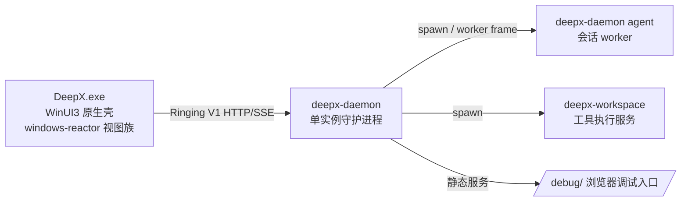

# WinUI3 原生迁移最终文档（WebView/Electron 移除收官）

> 状态：**已完成**（1.0.0-beta.8）
> 范围：DeepX 桌面前端从「Electron + WebView2 + SolidJS renderer」迁移为
> 「WinUI3 全原生视图族（Rust + windows-reactor）」的最终记录。
> 本文件是迁移终局的事实来源；后续 Windows 侧打磨均以本文描述为基线。

> **2026-08-08 架构补充**：这里的“已完成”仅指 WebView/Electron 和 Web
> 工具链已经移除、控件树已经原生化；不代表 renderer 的状态模型与协议消费方式
> 已经完全 WinUI 原生化。Ringing 2026-08-01 之后的 typed timeline、push state、
> typed navigation 与平台能力升级，以
> [WinUI 原生化架构审计](./winui-native-architecture-audit.md) 为后续事实来源。
> RC4 的 typed client 冻结与上游同步门禁见
> [RC4 原生客户端协议冻结与维护手册](./rc4-native-client-contract.md)。

---

## 1. 迁移目标与结果

**目标**：移除 WebView 与 Web 前端，桌面壳 100% Rust 原生，构建链零
node/pnpm 依赖；同时保持 daemon 协议（Ringing V1）与安装/更新链路不变。

**结果**：

| 维度 | 迁移前 | 迁移后 |
|---|---|---|
| 前端实现 | SolidJS renderer（WebView2 内）+ Electron main | WinUI3 原生 XAML 视图族（windows-reactor） |
| 桥接 | `deepx-bridge.js`（WebMessage / preload） | `bridge.rs` Rust 直连（无桥） |
| 数据通道 | Web 三频道事件 → store → 视图 | SSE 三频道 + timeline 流 → `BridgeCore` 缓存 → UI 泵 |
| 命令/查询 | Web 经 bridge 中转 | Rust 直发（`deepx-client`） |
| 前端工具链 | Vite + pnpm + vitest（node_modules ~3 万文件） | 无（纯 cargo） |
| 打包 | pnpm build → patch renderer → 复制产物 | cargo + PowerShell（prepare/assemble/collect/finalize） |
| 版本链 | renderer/package.json + deepx-backend.lock.json | `version.txt` + 根 `deepx-backend.lock.json` |

---

## 2. 迁移阶段回顾

### 阶段 1：协议先行（2026-07-31 定型）

Ringing V1（HTTP/SSE + lease + cursor + timeline）成为唯一主通道；
`deepx-client`（Rust）重写 Electron 的 control/ringing/timeline 客户端，
传输语义完全对齐。壳层替换不触及协议。

### 阶段 2：壳对等（beta.7）

WinUI3 壳 + WebView2 承载 SolidJS renderer，`deepx-bridge.js` 复刻
`window.deepx` 形状，renderer 零改动切换宿主；原生侧栏/标题栏先行落地。

### 阶段 3：WebView 移除（beta.8 分步）

1. **interaction/header 数据源原生化**：control 频道 ask/plan/permission
   事件直接组装 `InteractionState`（读路径直连）。
2. **动作直发**：协议请求（发送消息/会话管理/技能操作/权限响应）Rust 直发，
   不再经 Web 中转。
3. **composer 本地化**：A 组（isStreaming/gate/model/context）事件直连，
   B 组（mode/sendAck/submitError）本地缓存。
4. **删除 Rust→Web emit 通道**（第 5 步）、**移除 WebView2 元素与桥**（收官步）。
5. **ChatView 原生迁移**：conversation 事件直连 → `Transcript` 状态机 →
   reactor 控件树（markdown-winui crate 提供流式渲染）。

### 阶段 4：renderer 源码删除（最终收官）

- 删除 `apps/winui/renderer/`（SolidJS 源码 + node_modules）
- 删除 `deepx-bridge.js`、`patch-renderer.mjs`、`serve-renderer.mjs`
- 删除根 `pnpm-lock.yaml`、根 `node_modules`、installer 子 justfile（多仓库残留）
- `prepare-daemon.mjs` → `prepare-daemon.ps1`（sidecar 预置原生化）
- 版本锁迁移至根：`deepx-backend.lock.json`；`sync-version.ps1` 同步新路径
- justfile 移除全部 pnpm/node 配方；installer/updater 文档与 UI 文案去 Electron

---

## 3. 最终架构



### 3.1 壳侧（apps/winui/src）

- **bridge.rs**：`BridgeCore`（tokio 侧）连接管理 + 三 SSE 频道解析 +
  timeline 流；`Bridge`（UI 侧）心跳泵。会话切换/快照恢复/交互状态机/
  composer 活动追踪/健康重建（stall 检测 + 指数退避）。
- **chat_view.rs**：16ms 事件泵 drain `chat_events` → `Transcript` →
  ListView 虚拟化渲染。滚动语义 = Web `scrollTop=scrollHeight`（贴底，
  `ScrollToVerticalOffset`），100ms 滚动节流 + 33ms 渲染降频防反馈循环。
- **chat_adapter.rs**：wire 事件 → 渲染协议（含 `provider_tool_status`）；
  timeline 快照 → 恢复 turns。
- **视图族**：sidebar/header/home/skills/settings/info_panel/
  interaction_overlay/composer_bar，全部原生控件。

### 3.2 渲染层（crates/markdown-winui + markdown-core）

- `Transcript` 状态机：turn 壳 + thinking 气泡框 + tool 折叠卡 + live/final
  富文本（段落/表格/代码块）。
- 流式语义对齐 Web golden reference：未闭合语法字面输出、块级等 final、
  稳定 key 防抖。

### 3.3 版本与打包链

```text
version.txt（权威）
  └─ sync-version.ps1 → Cargo.toml / deepx-backend.lock.json / package.json

just winui-package：
  build-daemon + build-winui
  → prepare-daemon.ps1（sidecar：daemon/workspace exe + daemon-manifest.json，
     校验版本锁/protocol/build_id 嵌入）
  → assemble-winui.ps1（release/winui-app 运行目录）
  → collect-payload-winui.ps1（bundle.json，组件：runtime/backend/updater）
  → finalize.ps1（SFX）
```

---

## 4. 迁移中修复的关键缺陷（沉淀）

| 缺陷 | 根因 | 修复 |
|---|---|---|
| 冷启动历史不恢复 | ①快照被 `last_timeline_seed` 错标（refresh 不更新 + 并发竞态）→ 无限 deferred；②缓存完整 body 而 `timeline_turns` 读顶层 turns → 解析恒空 | 快照 seed 从 body 顶层读取（权威）；缓存解包 `snapshot` 子对象；快照缺失时主动重拉 |
| 流式卡死 + 不跟尾 | ①`ScrollIntoView` 只保证可见不贴底（Web 是 `scrollTop=scrollHeight`）；②16ms 一次滚动请求形成滚动-渲染反馈循环；③每帧全量克隆/构建/深度比较 | reactor 补 `ScrollToVerticalOffset` 贴底；滚动 100ms 节流 + 渲染 33ms 降频；结构变化（新 turn/restore/封口）立即滚底 |
| tool 消息不显示 | `provider_tool_status` 事件无协议变体 → serde `Unknown` 吞掉 | 协议补 `ProviderToolStatus`；按 call_id upsert 工具卡；折叠展示 |
| 思考链路样式错误 | thinking 用折叠器、tool 用卡片，与预期相反 | thinking 改气泡框（对齐用户气泡），tool 卡改折叠器 |

---

## 5. 遗留事项（非阻塞）

- **daemon `/debug/` 静态服务**：框架保留（`debug_http.rs`），不再承载前端
  产物；`DEEPX_DEBUG_RENDERER_DIR` 指定任意静态目录时仍可服务。如需移除，
  需同步删 `server.rs` dispatch 与 `main.rs` mod。
- **代码高亮**：ChatView 代码块为 plain 展示，syntect 未接入
  （CHATVIEW-RENDERING-REFERENCE 降级阶梯第一级之上）。
- **数据分页**：ChatView 当前全量快照渲染（`ISupportIncrementalLoading`
  未实现，长会话靠 ListView 虚拟化兜底）。
- **markdown 特性**：katex/mermaid/G6 无原生等价物（Web 端能力，未迁移）。
- **`timeline_status_to_json` / `base64_encode`**：bridge.rs 遗留 dead code，
  待清理（不影响构建）。

---

## 6. 后续打磨方向（Windows 侧前端）

基于本文基线，WinUI3 前端可继续打磨：

1. **渲染层**：代码高亮（syntect）、思考/工具卡样式 token 化（对齐
   `CHATVIEW-RENDERING-REFERENCE` 特性矩阵）、长会话分页加载。
2. **交互**：消息操作菜单（复制/重新生成/删除）、附件预览、拖拽发送。
3. **体验**：会话搜索、主题定制（目前跟随系统深浅色）、窗口状态记忆。
4. **性能**：ListView 行缓存（keyed Element 复用）、live 段增量 diff、
   滚动锚点补偿（Web 端 `anchor` 语义的原生等价物）。
5. **更新**：壳内更新提示 UI 接通 `pending.json`（UPDATE_ARCHITECTURE M3
   的 UI 层）。

---

## 7. 相关文档索引

- `apps/winui/README.md` — 壳 README（当前状态）
- `apps/winui/CHATVIEW-RENDERING-REFERENCE.md` — ChatView 渲染规格
- `docs/windows-reactor-skill.md` — windows-reactor 开发要点
- `apps/installer/UPDATE_ARCHITECTURE.md` — 更新架构（WinUI 时代）
- `docs/ringing-migration-map.md` — Ringing 协议迁移地图
- `docs/frontend-PLAN.md` — 前端规划（历史）
